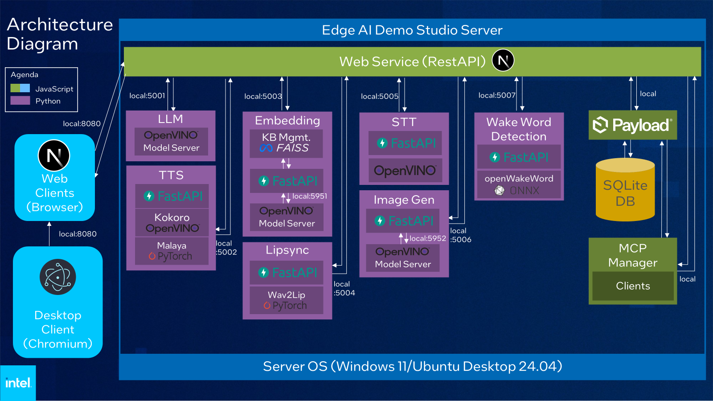

# Edge AI Demo Studio

Edge AI Demo Studio is a modern toolkit for deploying, managing, and serving AI models on edge platforms. It features a web-based UI for device, workload, and user management, and is optimized for Intel hardware and edge environments.


## Features

- **Easy Model Deployment:** Download, convert, and serve Hugging Face models with minimal setup.
- **Web-Based Management:** Manage devices, workloads, and users through a modern web interface.
- **Edge Optimized:** Built for Intel hardware and edge environments.
- **AI Services:** AI Services that users can use for their applications
  - **Text Generation** — Generate coherent text using large language models optimized for Intel hardware.
  - **Text to Speech** — Natural-sounding speech synthesis with multiple voice options powered by Kokoro TTS.
  - **Speech to Text** — Real-time speech recognition with low-latency transcription using Whisper models optimized for Intel hardware.
  - **Speaker Diarization** — Identify and label speakers in audio recordings using pyannote.audio speaker diarization models.
  - **Text Embedding** — Generate dense vector embeddings for semantic search and RAG pipelines.
  - **Reranker** — Rescore and rerank documents by relevance for improved search and RAG pipelines.
  - **Vector Database** — FAISS-based vector storage for knowledge base management, semantic search, and RAG pipelines.
  - **Lipsync** — Real-time avatar lip-syncing with Wav2Lip, streamed over WebRTC.
  - **Image Generation** — Generate images from text prompts using diffusion models accelerated with OpenVINO.
  - **MCP Manager** — Manage Model Context Protocol servers and their tool integrations.
  - **Wake Word Detection** — Detect custom wake words from microphone input and send webhook notifications on detection events.
- **Samples:** Sample use cases that implement the AI services (see [Exporting Samples](#exporting-samples) to package a subset for standalone deployment)
  - **Digital Avatar** — Interact with an AI-powered avatar that combines real-time video with intelligent conversation.
  - **Digital Avatar Lite** — A lightweight animated robot avatar that brings conversations to life with responsive movements and expressions.
  - **RAG Chatbot** — Upload documents and chat with an AI that retrieves relevant context to answer your questions.
  - **Medical Scribe** — Automatically transcribe and diarize doctor-patient conversations, then generate structured SOAP notes.
  - **Webcam Capture with VLM** — Demonstrate the integration of webcam capture and Visual Language Model (VLM) for enhanced interaction.
  - **[AI Exam Marking](./frontend/src/samples/ai-exam-marking/README.md)** — AI-powered exam marking using OCR and LLM to automatically grade test papers from images.
  - **PowerPoint Translator** — Translate PowerPoint presentations while preserving formatting using AI.
  - **[Geti Image Classification](./frontend/src/samples/geti-classifier/README.md)** — Classify images using a local Intel Geti deployment and send feedback for continuous model improvement.
  - **Synthetic Image Generation** — Generate and edit synthetic images from base images in real-time for dataset augmentation.
  - **Robotics AI** — A demo showcasing the capabilities of Robotics AI, including real-time object detection and manipulation.
- **Suites:** Curated industry-specific AI solution packages built on Intel Edge AI Suites
  - [*Manufacturing AI Suite*](https://github.com/open-edge-platform/edge-ai-suites/tree/main/manufacturing-ai-suite) — A comprehensive toolkit for building, deploying, and scaling AI applications in industrial environments. Enables real-time integration with optimized hardware for production workflow automation, workplace safety, defect detection, and asset tracking.
    - [**Pallet Defect Detection**](https://github.com/open-edge-platform/edge-ai-suites/tree/main/manufacturing-ai-suite/industrial-edge-insights-vision) — Real-time pallet condition monitoring on warehouse video streams using DL Streamer Pipeline Server, OpenVINO inference, and WebRTC streaming.
  - [*Metro AI Suite*](https://github.com/open-edge-platform/edge-ai-suites/tree/main/metro-ai-suite) — Accelerates application development for edge AI video safety, security, and smart city use cases. Includes OpenVINO™ toolkit, Deep Learning Streamer, and Intel® oneAPI Toolkit for media analytics and AI performance optimization.
    - [**Image-Based Video Search**](https://github.com/open-edge-platform/edge-ai-suites/tree/main/metro-ai-suite/image-based-video-search) — Near real-time image-based similarity search over live video streams using YOLOv11 object detection, ResNet-50 feature extraction via DL Streamer, and Milvus vector indexing.
  - [*Retail AI Suite*](https://github.com/open-edge-platform/edge-ai-suites/tree/main/retail-ai-suite) — Accelerates development of edge AI applications for retail environments, enabling intelligent automation for use cases such as self-checkout, loss prevention, and store analytics with optimized Intel hardware and the OpenVINO™ toolkit.
    - [**Loss Prevention**](https://github.com/intel-retail/loss-prevention/tree/main) — Real-time self-checkout loss prevention using object detection and analytics to identify mis-scans and suspicious activity at the point of sale.

## Architecture Diagram


## Software Requirements

- **Operating System:**
  - Ubuntu 24.04 LTS (other Linux distributions may work, but are not officially supported)
  - Windows 11 24H1 (other versions may work, but this is the validated version)
- **Other:** See [install_dependencies.sh](install_dependencies.sh) for required system packages.

---


## Quick Start

### 1. Install System Dependencies (Linux only)

```bash
sudo ./install_dependencies.sh
```

### 2. Set Up Python & Node.js Dependencies

For Linux:
```bash
./setup.sh
```
For Windows (PowerShell/Command Prompt):
```bash
./setup_win.bat
```

This will:
- Set up a Python virtual environment
- Install Python and Node.js dependencies
- Start the frontend

---

### 3. Start the App
For Linux:
```bash
./start.sh
```
For Windows (PowerShell/Command Prompt):
```bash
./start_win.bat
```

Once started, access the web UI at [http://localhost:8080](http://localhost:8080).

---

## Exporting Samples

The **Export Samples** feature lets you produce a slim, self-contained copy of Demo Studio that contains only the sample(s) you select, together with the services and workers they depend on. The exported directory includes its own `setup.sh` / `setup_win.bat` and `start.sh` / `start_win.bat` scripts so it can be set up and run independently.

### Via the Launcher Script

Run from the repository root — Node.js is bootstrapped automatically from `thirdparty/` if not already installed. The script lists all available samples, lets you pick one or more by number, then prompts for output directory, optional dependencies, and dry-run preference.

For Linux:
```bash
./export.sh
```

For Windows (PowerShell/Command Prompt):
```bat
.\export.bat
```

### Via the Frontend GUI

1. Open the web UI and navigate to the **Samples** page (`http://localhost:8080/samples`).
2. Click **Select to export** (top-right area of the page) to enter selection mode.
3. Check the sample card(s) you want to export.
4. Click the **Export selected** button (download icon) that appears in the selection toolbar.
5. Review the resolved export plan in the dialog — it lists the required services, any optional services (toggle **Include optional services** on/off), and the workers that will be bundled.
6. Click **Export** to download a `.zip` archive of the self-contained project.

---

### Docker

See [docker/README.md](docker/README.md) for docker guidelines.

---


## Project Structure

```
applications.ai.tools.edge-ai-demo-studio/
├── electron/         # Electron app
├── frontend/         # Next.js web frontend
├── workers/          # Python/AI backend services
├── models/           # Downloaded/converted models
├── scripts/          # Utility scripts
├── install_dependencies.sh  # System dependency installer
├── setup.sh / setup.ps1     # Project setup scripts
└── README.md
```

---


## Deployment

The app is deployed using Electron to package the application.
See [docs/DEPLOYMENT.md](docs/DEPLOYMENT.md) for deployment guidelines.

---


## FAQ

**Q: Why is Electron Skipped by default**

This is because Electron is being used to create a packaged release only. If you need a packaged release, please refer to [docs/DEPLOYMENT.md](docs/DEPLOYMENT.md)
