# Geti Inference Pipeline

Geti Inference Pipeline enables AI software vendors (ISV) to rapidly develop, deploy, and scale imaging AI solutions through a reusable, modular, and optimized reference pipeline built on Intel technologies.

## Features

- **Unified Workflow:** End-to-end pipeline from data ingestion → inference → feedback loop for streamlined AI development.
- **Modular Pipeline:** Supports segmentation and classification tasks through interchangeable, composable pipeline stages.
- **Reusable Components:** Shared building blocks designed to work across multiple imaging modalities with minimal reconfiguration.
- **Integrated Model Development & Deployment:** Leverages Intel Geti and the Geti SDK for seamless model training, versioning, and deployment.
- **Edge Optimized:** Execution optimized for Intel edge platforms using OpenVINO and Intel hardware acceleration.

## Architecture Diagram
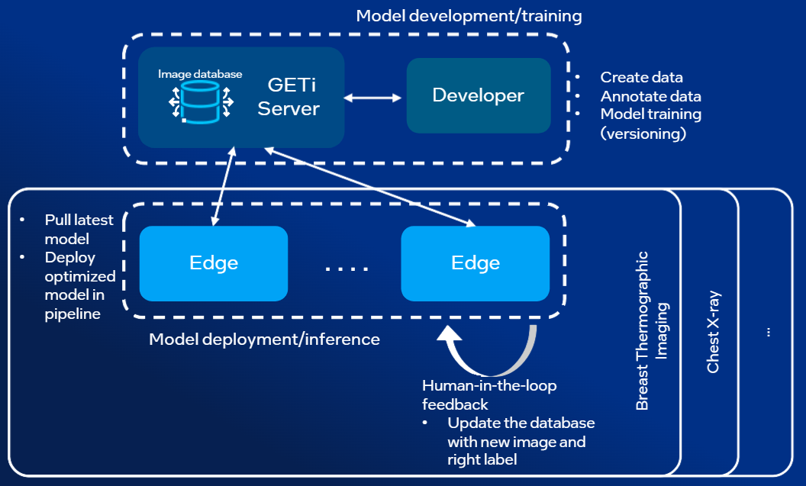

---

## Quick Start

### 1. Set Up Geti Server

This pipeline requires a running Intel Geti server instance. Follow the official Geti setup 
instructions to get your server up and running before proceeding.

[Intel Geti — Setup & Installation Guide](https://github.com/open-edge-platform/geti)

Once your Geti server is running, return here to continue with the next steps.

---

### 2. Create a Project

Create a new project in your Geti server instance. A project defines the task type 
(e.g. segmentation, classification) and organizes your datasets and models.

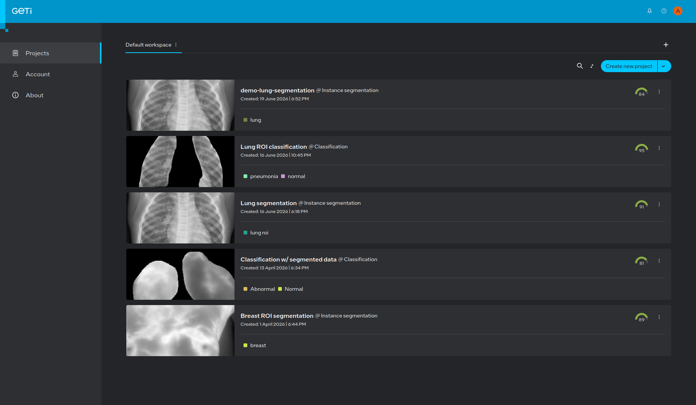
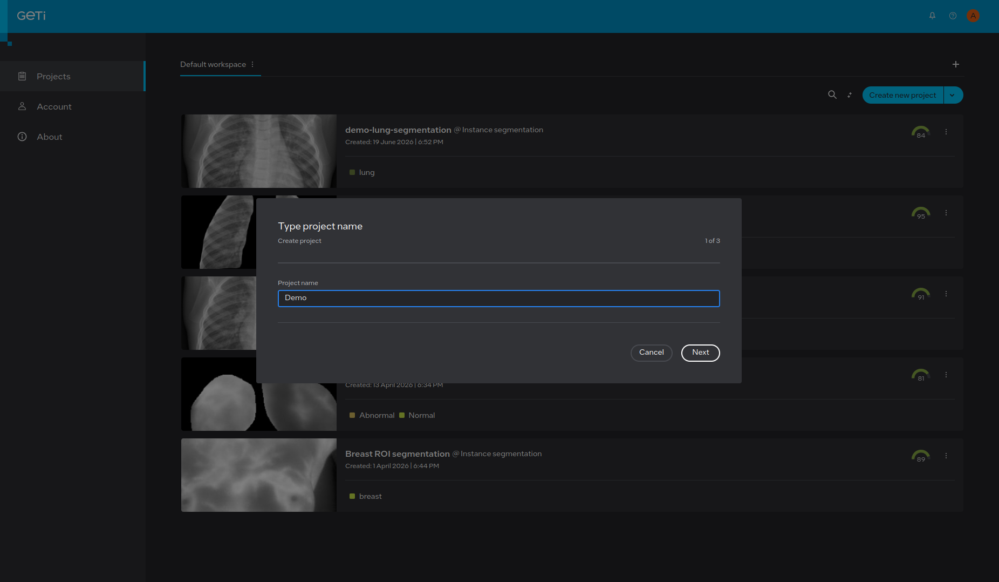

---

### 3. Choose Task Type

When setting up your project, select either **Classification** or **Segmentation** as your task type.

> **Important:** The Geti Inference Pipeline AI Suite is validated and optimized for 
> **Classification** and **Segmentation** tasks only. To ensure full compatibility with 
> the pipeline, it is strongly recommended to select one of these two task types.

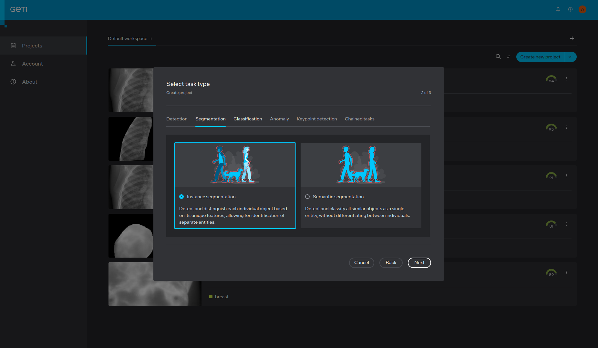
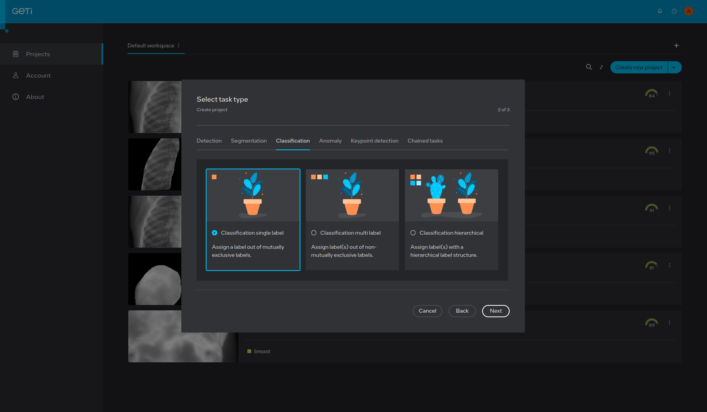

---

### 4. Create Labels

Add label names that correspond to the classes present in your dataset. Ensure your labels 
match exactly with the existing labels defined in the provided sample dataset to avoid 
mismatches during training and inference.

> **Tip:** A sample dataset with predefined labels is available for reference.  
> [Download Sample Dataset](https://data.mendeley.com/datasets/rscbjbr9sj/2) 

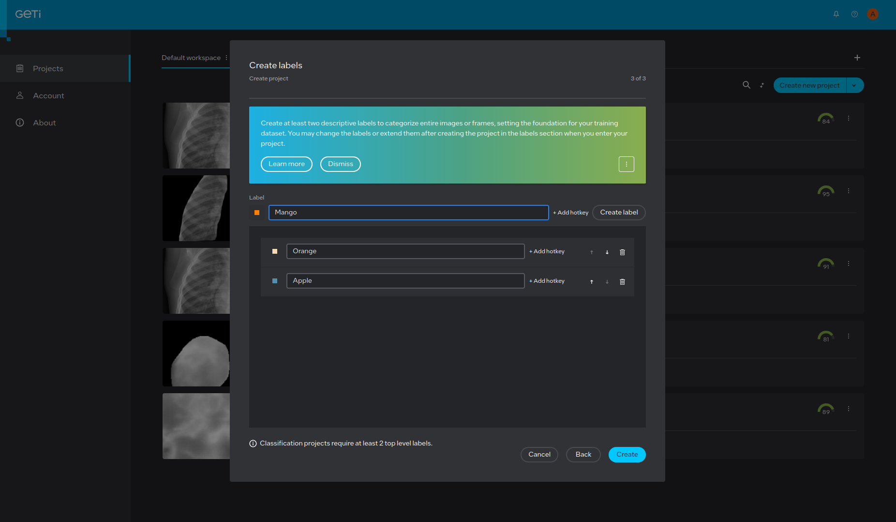

---

### 5. Import Dataset

Import your dataset into the project. You can use the provided sample dataset to get 
started quickly.

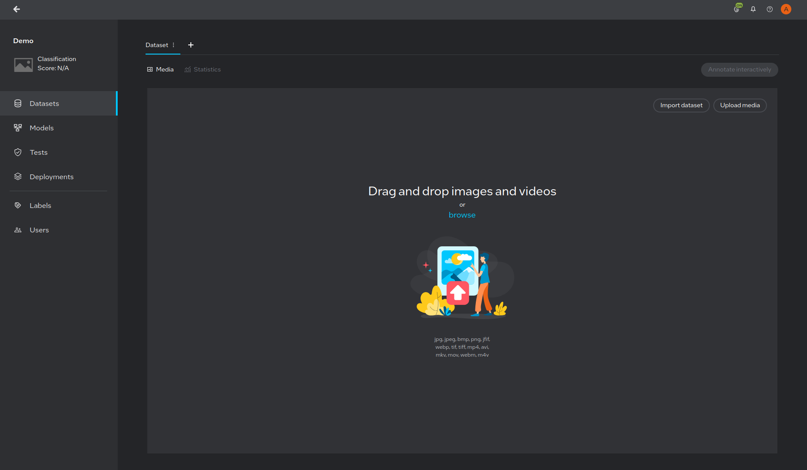
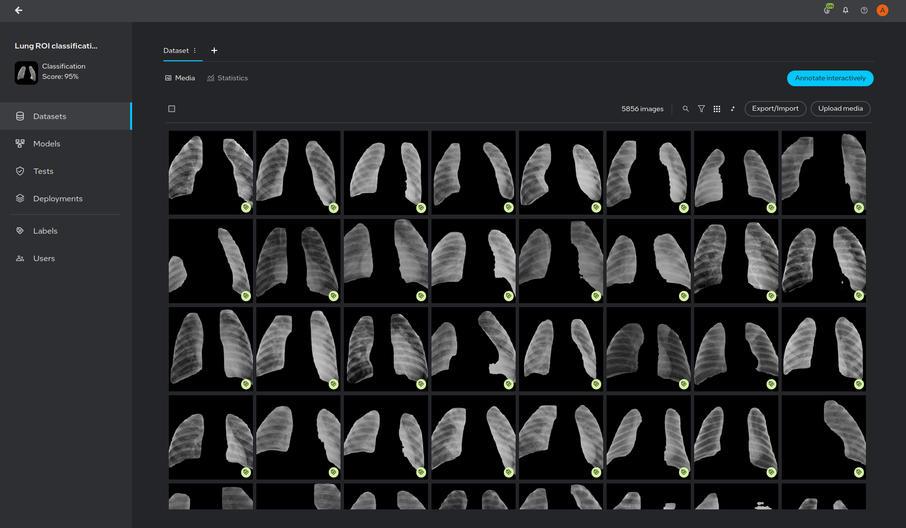

---

### 6. Train Model
    
1. Navigate to the **Models** tab in your project.
2. Click **Train Model** to start the training process.
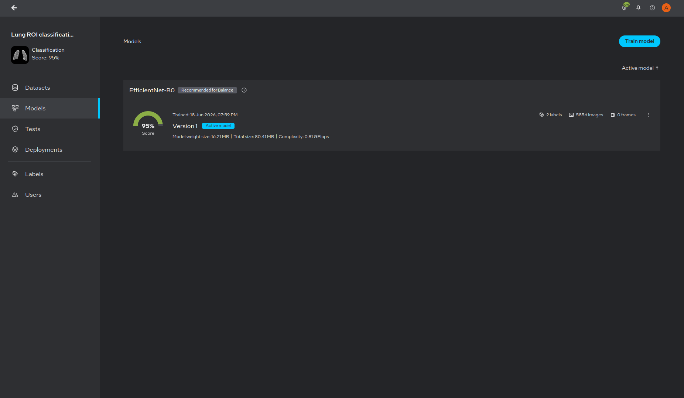
3. Select your preferred model type/architecture from the available options and Start the training process.
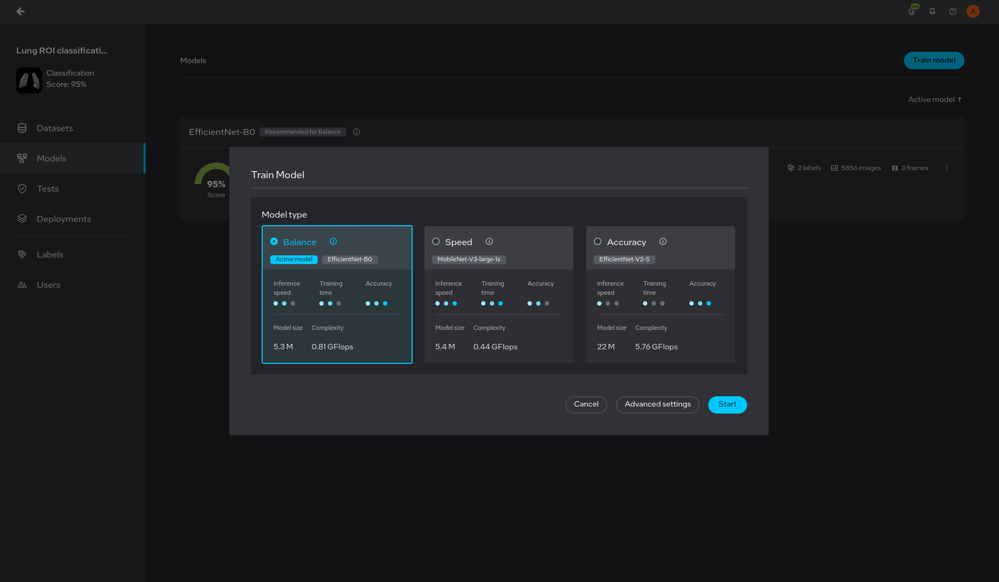
4. Once training is complete, review the **model score** and performance metrics to 
   evaluate the result.

---

### 7. Run Tests

1. Navigate to the **Tests** tab in your project.
2. Click **Run Test** to evaluate your trained model.
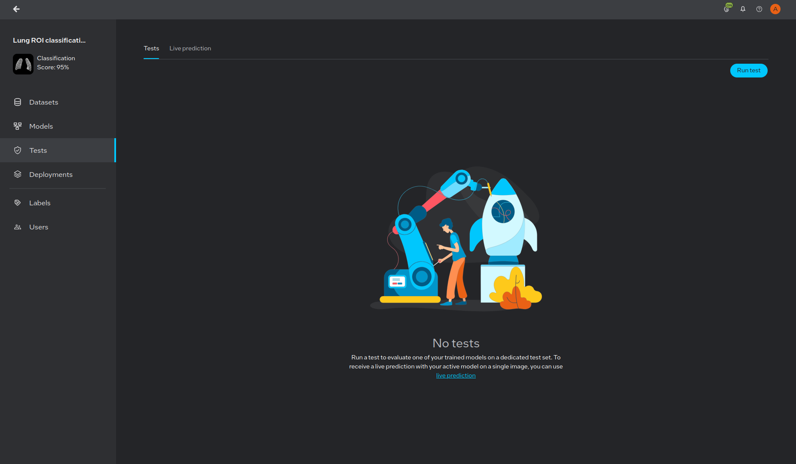
3. Configure your test settings and select the model to test.
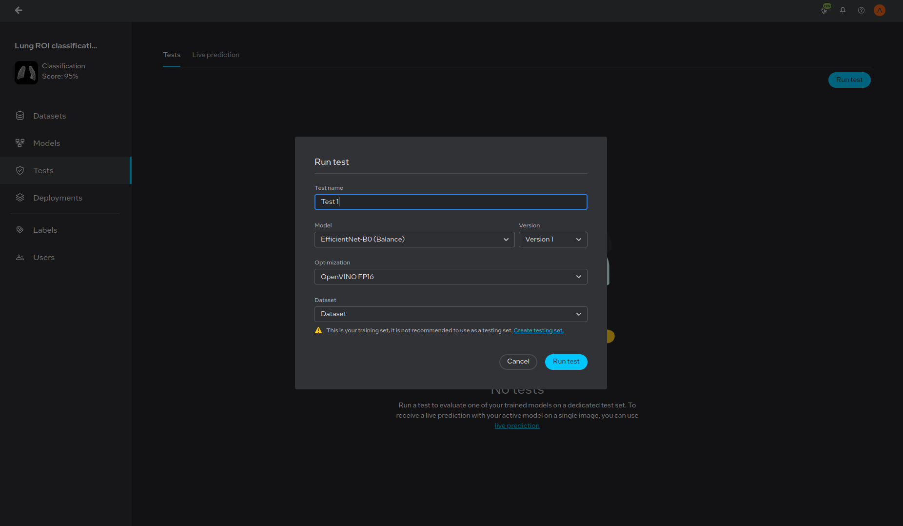
4. Review the scores and metrics to confirm the model meets your performance requirements 
   before deployment.
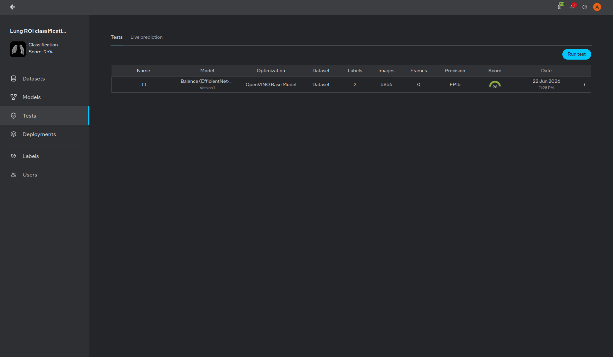
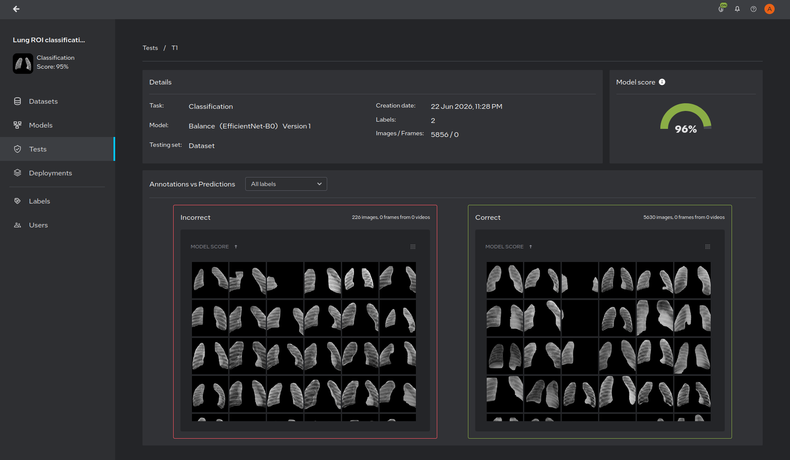

---

### 8. Deploy with Geti Inference Pipeline

Once your model is trained and validated, deploy it using the **Geti Inference Pipeline**
for edge AI inferencing.

- **Export Model** — Export the optimized model from Geti (OpenVINO IR format).
- **Configure Pipeline** — Point the pipeline configuration to your exported model.
- **Run Inference** — Execute the pipeline on your Intel edge platform.
- **Feedback Loop** — Capture inference results and feed them back into Geti for 
  continuous model improvement and retraining.

---
