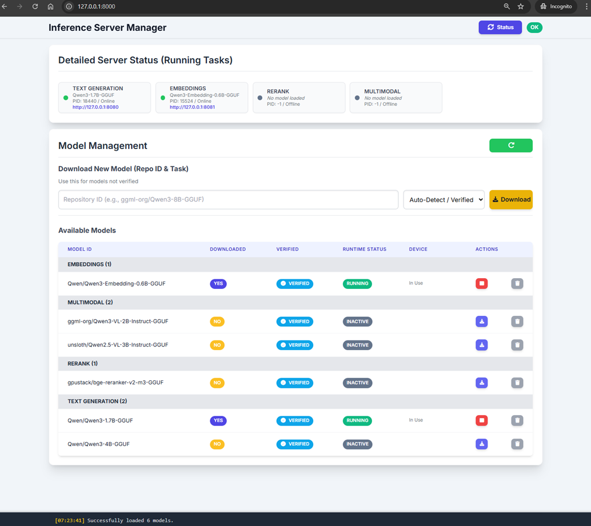
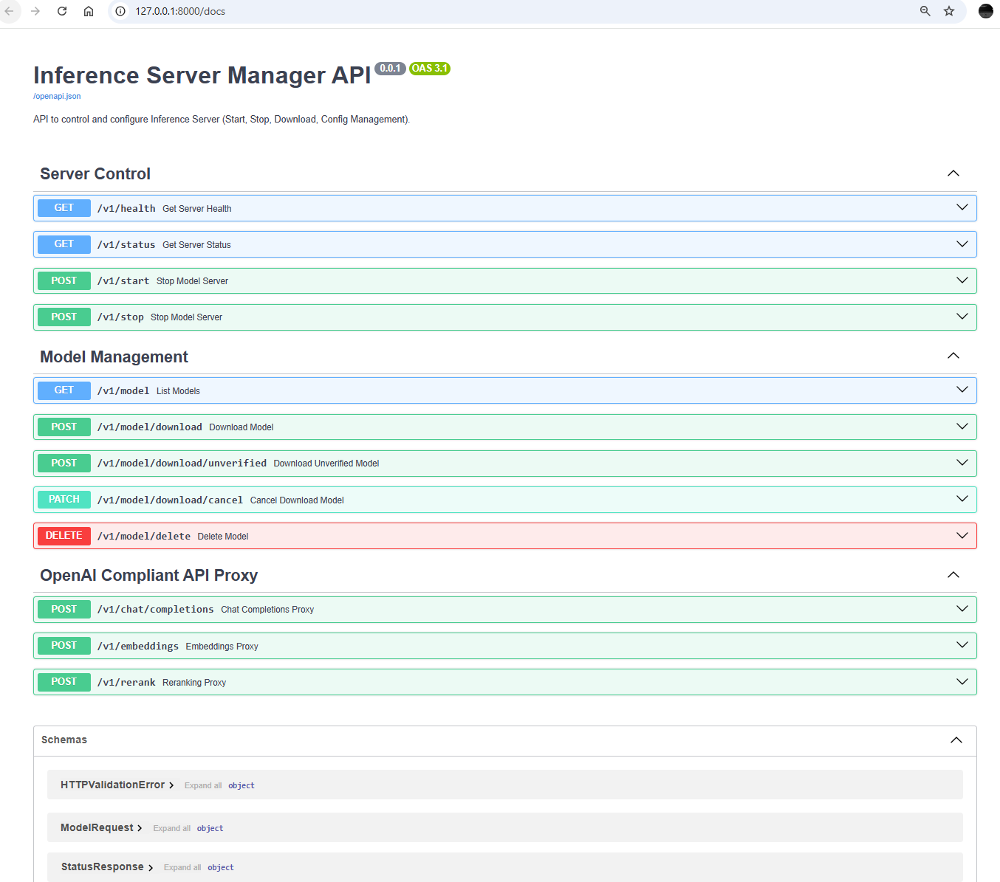

<!-- filepath: c:\Users\user\applications.ai.multiserve\README.md -->
# Multi-Backend Inference Server

A unified, local inference server for managing, running, and monitoring multiple LLM backends (Llama.cpp, OpenAI-compatible APIs, and more) with a modern web dashboard and tray integration.

## Features

- **Model Management**: Download, verify, start, stop, and delete LLM models from Hugging Face or manually.
- **Multi-Task Support**: Supports text generation, embeddings, reranking, and multimodal models.
- **Device Selection**: Run models on CPU, GPU, or NPU (if supported).
- **Web Dashboard**: Modern UI for status, logs, and model management.
- **Tray App**: System tray integration for quick access and server control.
- **OpenAI Proxy**: Exposes OpenAI-compatible endpoints for easy integration.
- **Cross-Platform**: Windows and Linux support.

## Directory Structure

```
.
├── app.py                  # Main FastAPI application entrypoint
├── modules/                # Core Python modules
│   ├── llamacpp/           # Llama.cpp management and GGUF downloader
│   ├── ovms/               # OpenVINO Model Server (OVMS) backend management   
│   ├── tray_app.py         # System tray integration
│   └── utils.py            # Utility functions
├── routers/                # FastAPI routers (API endpoints)
├── engine/                 # Native binaries, licenses, and XPU headers
├── static/                 # Web dashboard static files
├── tests/                  # Example tests
├── config.yaml             # Model/task configuration
├── verified.yaml           # List of verified models
├── pyproject.toml          # Python dependencies
├── app-vulkan.spec         # PyInstaller spec for building executable
└── README.md               # This file
```

## Prerequisites

- **Git**: Install via winget:
  ```sh
  winget install --id Git.Git -e --source winget
  ```

- **Python 3.12**: Install via winget:
  ```sh
  winget install Python.Python.3.12 --source winget
  ```

- **MS VC Redist**: Install via winget:
  ```sh
  winget install --id Microsoft.VCRedist.2015+.x64 --source winget
  ```
  
## Quick Start

1. **Clone the repository and run setup**

   ```sh
   git clone <repository-url>
   cd applications.ai.multiserve
   setup.bat
   ```

2. **Set the backend**

   Choose your desired backend by setting the environment variable:

   ```sh
   # For LlamaCPP backend
   set MULTISERVE_BACKEND=llamacpp

   # For OVMS backend
   set MULTISERVE_BACKEND=ovms
   ```

3. **Run the server in headless mode**

   ```sh
   uv run app.py --headless
   ```

4. **Access the dashboard**  
   Open [http://127.0.0.1:9090](http://127.0.0.1:9090) in your browser.

## Building a Standalone Executable

1. **Build the executable (Only support llamacpp)**

   ```sh
   pyinstaller app-vulkan.spec
   ```

2. **Run the standalone executable**

   ```sh
   C:\Users\user\applications.ai.multiserve\dist\InferenceServerManager-Vulkan.exe --headless
   ```

## Model Management

- **Download**: Use the dashboard or API to download models by Hugging Face repo ID.
- **Start/Stop**: Start or stop models for different tasks (text generation, embeddings, rerank, multimodal).
- **Device Selection**: Choose CPU/GPU/NPU for inference (if available).
- **Logs**: View download and runtime logs in the dashboard.

## API Endpoints

- **/v1/model**: List available/downloaded models
- **/v1/start**: Start or swap a model
- **/v1/stop**: Stop a running model
- **/v1/download**: Download a model
- **/v1/delete**: Delete a model
- **/v1/status**: Get server and model status
- **/v1/chat/completions**: OpenAI-compatible endpoints
- **/v1/embeddings**: OpenAI-compatible endpoints
- **/v1/rerank**: OpenAI-compatible endpoints

## Configuration

- **config.yaml**: Controls active models and default parameters.
- **verified.yaml**: List of models considered "verified" for auto-discovery.

## Testing

The project includes comprehensive smoke tests for both backends (LlamaCPP and OVMS). Tests are organized into tiers:

- **Tier 1 (Safe)**: Read-only operations (always enabled)
- **Tier 2**: Download verified models
- **Tier 3**: Test all verified models (start/API/stop)
- **Tier 4**: Additional API operations (download unverified, cancel, delete)
- **Tier 5**: OpenAI-compatible API tests
- **Tier 6**: Model upload tests

### Running Tests

**For LlamaCPP backend:**

```sh
cd tests\smoke_test_pytest
test_llamacpp.bat
```

You'll be prompted to enter the path to a GGUF file for upload testing (optional).

**For OVMS backend:**

```sh
cd tests\smoke_test_pytest
test_ovms.bat
```

You'll be prompted to enter the path to an OpenVINO model folder for upload testing (optional).

### Test Configuration

Control which test tiers to run via environment variables in the batch scripts:

```sh
# Enable all tiers (set to 1 to enable, 0 to disable)
set LLAMACPP_TEST_DOWNLOAD_VERIFIED=1
set LLAMACPP_TEST_VERIFIED_MODELS=1
set LLAMACPP_TEST_ADDITIONAL_API=1
set LLAMACPP_TEST_OPENAI_API=1
set LLAMACPP_TEST_UPLOAD=1
```

## Building a Standalone App

This project supports PyInstaller for packaging as a standalone executable. See [app.spec](app.spec) for build configuration.

## Running the App

App will launched in tray mode


Click the **Open Management UI** will launch the dashboard in browser



Click the **Open API Docs** will launch the Swagger API docs in browser



---