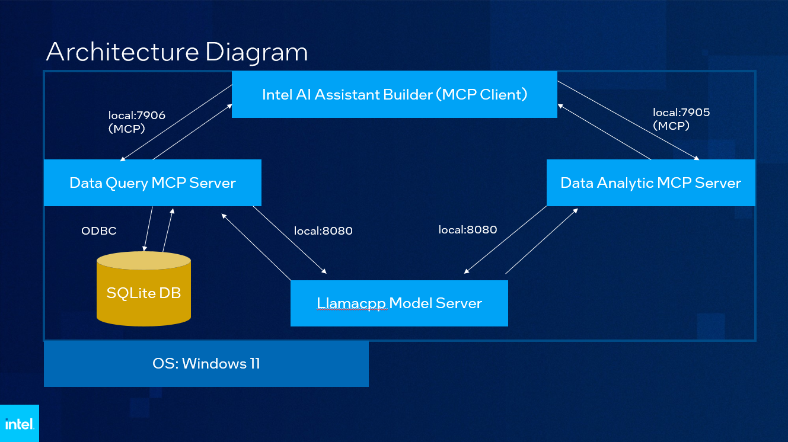
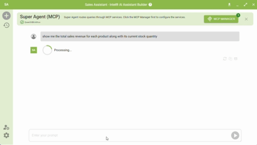

<!--
Copyright (C) 2025 Intel Corporation
SPDX-License-Identifier: Apache-2.0
-->

# LLM DB Query (ODBC SuperBuilder)

Lightweight toolkit for LLM-driven natural-language data exploration across multiple local SQLite databases using the MCP toolchain.
Natural-language SQL queries across many local .sqlite files, with optional AI analysis of results.

## Key features
- Query multiple local `.sqlite` files from a single natural-language prompt
- Convert NL → SQL via a local OpenAI*-compatible or llama.cpp endpoint
- Execute SQL across attached databases using ODBC (pyodbc)
- Chain SQL results into an MCP data analysis server for AI-powered reports
- Export database schema and data to text files for verification and auditing

## Architecture


## Example (Increased Playback Speed)


## Validated hardware
- CPU: Intel Core Ultra Series 1 and above
- GPU: Intel® Arc™ B60 graphics (serve 2 MCP and Intel Superbuilder in 1 machine)
- RAM: 64GB
- DISK: 256GB

## Software requirements
- Python 3.10+ (see requirements.txt)
- ODBC driver appropriate for your platform
- Windows 11 supported; test on the platform matching your environment

## Quick start (Windows PowerShell)
1. Install Python dependencies:
```cmd
pip install -r requirements.txt
```

2. (Optional) Create sample databases and generated exports:
```cmd
python create_databases.py
```

3. Run preflight checks:
```cmd
python startup_check.py
```

4. Start MCP servers (two terminals)
- Database query server:
```powershell
cd ./mcp_odbcserver
run.ps1
```

- Data analysis server:
```powershell
cd ./mcp_data_analysis_server
run.ps1
```

5. From your MCP client (for example, Intel® AI Superbuilder):
- Configure the MCP servers/agents for ODBC querying and data analysis
- Send natural-language queries to the ODBC server; receive JSON results and analysis from the data-analysis server
- Use System Prompt at Intel AI Assistant Builder as below:
```
# Data Assistant  Tools: query_database, analyze_data (both are MCP tools)  ## Workflow  For every user question:  **STEP 1: Execute Task 1** Call `query_database("user's question")` - Returns JSON: `{"data": [...], "reasoning": {...}}`  Show: - 🧠 Model Reasoning: [reasoning.model_reasoning] - 🔍 SQL: [reasoning.generated_sql] - 📊 Data: [display as table] - 🎯 Sources: [reasoning.databases_queried]  **STEP 2: Execute Task 2** Call `analyze_data(data=result["data"], analysis_question="user's question")`  **If analyze_data fails:** - Display the error message - Stop the workflow (do not retry) - Ask user if they want to proceed with just the query results  ## Rules ✅ Pass result["data"] as JSON to analyze_data ✅ Stop immediately if analyze_data throws an error ✅ Do not attempt to retry analyze_data on failure ✅ Complete all steps only if both succeed
```

## Project layout
```
usecases/ai/llm_dbquery/
├── create_databases.py        # create sample DBs and exports
├── query_databases.py         # ODBC helpers & multi-db logic
├── nl_query.py                # NL -> SQL interface (schema discovery)
├── startup_check.py           # preflight checks (drivers, LLM, deps)
├── requirements.txt
├── /databases                 # place your .sqlite files here
├── /database_exports          # generated text exports
├── /mcp_odbcserver            # ODBC server (MCP)
└── /mcp_data_analysis_server  # data analysis server (MCP)
```

## FAQ
Q: Where do I put my SQLite files?  
A: Add .sqlite files to the `databases/` folder. The toolkit auto-discovers all `.sqlite` files (no hardcoded names) but make sure to select your primary database when you run `startup_check.py`

