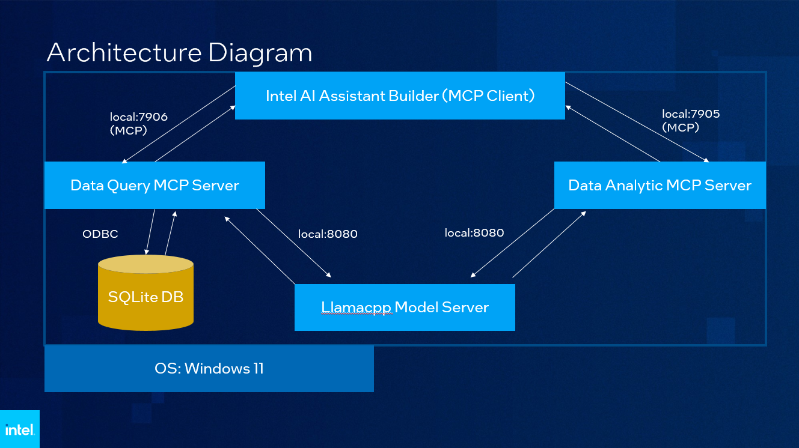
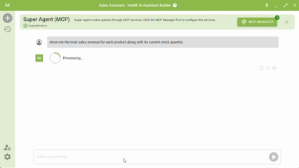

<!--
Copyright (C) 2025 Intel Corporation
SPDX-License-Identifier: Apache-2.0
-->

# LLM DB Query (ODBC SuperBuilder)

Lightweight toolkit for LLM-driven natural-language data exploration across multiple local SQLite* databases using the MCP toolchain.
Ask questions in plain English and get SQL queries, data results, statistical analysis, and charts — all powered by a local LLM.

## Key Features

- Query multiple local `.sqlite` files from a single natural-language prompt
- Convert NL → SQL via a local OpenAI*-compatible or llama.cpp endpoint
- Execute SQL across attached databases using ODBC (pyodbc*)
- Chain SQL results into an MCP data-analysis server for statistical reports and charts
- Domain-based database organization (manufacturing or retail)
- Auto-discover database schemas with AI-generated metadata

## Architecture



## Example (Increased Playback Speed)



## Validated Hardware

- CPU: Intel® Core™ Ultra Series 1 and above
- GPU: Intel® Arc™ B60 graphics (serve 2 MCP servers and Intel® Superbuilder on 1 machine)
- RAM: 64 GB
- Disk: 256 GB

## Software Requirements

- Python* 3.10+
- SQLite* ODBC driver ([download](http://www.ch-werner.de/sqliteodbc/) — install `sqliteodbc_w64.exe` for 64-bit Windows*)
- A local OpenAI*-compatible LLM server (for example, llama.cpp) running on `http://127.0.0.1:8080/v1`
- Windows* 11 supported

## Setup Flow

The system requires four phases to go from zero to a working deployment:

### Phase 1 — Install Dependencies

```powershell
cd samples/ai/llm_dbquery
pip install -r requirements.txt
```

Each MCP server also has its own virtual environment. Run the setup script inside each server folder:

```powershell
cd mcp_odbcserver
.\setup.ps1          # creates venv and installs server dependencies

cd ..\mcp_data_analysis_server
.\setup.ps1          # creates venv and installs server dependencies
```

### Phase 2 — Generate Databases

Choose **one** domain and generate its databases:

| Domain | Generator Script | Output Folder | Description |
|--------|-----------------|---------------|-------------|
| **Manufacturing** | `python generate_db.py` | `databases/db_manu/` | EMS contractor FCT databases with central tracking DB, production data, yield analysis |
| **Retail** | `python generate_retail_db.py` | `databases/db_retail/` | Retail store DB with products, customers, transactions, inventory |

> **Note:** The MCP ODBC server loads databases from `databases/db_manu/` or `databases/db_retail/` based on the `--domain` flag. Place your `.sqlite` files in the correct domain subfolder.

### Phase 3 — Run Preflight Checks

```powershell
python startup_check.py
```

This runs seven sequential checks:

| # | Check | Purpose |
|---|-------|---------|
| 1 | Databases | Verifies `.sqlite` files exist in `databases/` |
| 2 | Schema metadata | Checks for `*_meta.json` files; offers to generate missing ones via the LLM |
| 3 | Database schemas | Auto-discovers all databases; **prompts you to select primary database(s)** |
| 4 | ODBC driver | Verifies SQLite* ODBC driver is installed |
| 5 | llama.cpp server | Pings `http://127.0.0.1:8080/v1/models` to verify the LLM is running |
| 6 | Python* dependencies | Checks that pyodbc, pandas, openai, and requests are installed |
| 7 | MCP server files | Verifies `mcp_odbcserver/server.py` and `mcp_data_analysis_server/server.py` exist |

After check 3, your primary database selection is saved to `.primary_db_config`.

### Phase 4 — Start MCP Servers

**Option A — Batch launcher** (opens two terminal windows):

```cmd
start_mcp_servers.bat manu
```

or

```cmd
start_mcp_servers.bat retail
```

**Option B — Manual start** (two separate terminals):

Terminal 1 — ODBC query server:

```powershell
cd mcp_odbcserver
python server.py start --domain manu --port 7905
```

Terminal 2 — Data analysis server:

```powershell
cd mcp_data_analysis_server
python server.py start --port 7909
```

The ODBC server **requires** a `--domain` argument (`manu` or `retail`) to know which database folder to load.

### Phase 5 — Connect Your MCP Client

From your MCP client (for example, Intel® AI Superbuilder):

1. Configure the MCP servers/agents for ODBC querying and data analysis.
2. Send natural-language queries to the ODBC server; receive JSON results and analysis from the data-analysis server.
3. Use the following system prompt at Intel® AI Assistant Builder:

```
# Data Assistant
Tools: query_database, analyze_data (both are MCP tools)

## Workflow
For every user question:

**STEP 1: Execute Task 1**
Call `query_database("user's question")`
- Returns JSON: `{"data": [...], "reasoning": {...}}`

Show:
- 🧠 Model Reasoning: [reasoning.model_reasoning]
- 🔍 SQL: [reasoning.generated_sql]
- 📊 Data: [display as table]
- 🎯 Sources: [reasoning.databases_queried]

**STEP 2: Execute Task 2**
Call `analyze_data(data=result["data"], analysis_question="user's question")`

**If analyze_data fails:**
- Display the error message
- Stop the workflow (do not retry)
- Ask user if they want to proceed with just the query results

## Rules
✅ Pass result["data"] as JSON to analyze_data
✅ Stop immediately if analyze_data throws an error
✅ Do not attempt to retry analyze_data on failure
✅ Complete all steps only if both succeed
```

## MCP Server Tools

### ODBC Server (`mcp_odbcserver/`, default port 7905)

| Tool | Description |
|------|-------------|
| `query_database(question)` | Accepts a natural-language question, converts it to SQL, executes it across the domain databases, and returns JSON with data and reasoning |

### Data Analysis Server (`mcp_data_analysis_server/`, default port 7909)

| Tool | Description |
|------|-------------|
| `analyze_data(data, analysis_question)` | Performs statistical analysis on query results (counts, distributions, trends) — no LLM required |
| `visualize_data(data, visualization_request)` | Generates matplotlib* charts (bar, line, scatter, pie, heatmap) and returns a URL to the chart image |

## Schema Metadata (Optional)

Generate AI-powered schema documentation to improve SQL generation accuracy:

```powershell
python schema_bootstrap.py                      # process all databases
python schema_bootstrap.py --domain manu        # process manufacturing databases only
python schema_bootstrap.py --db central --auto  # process one database, skip review
```

This introspects each database, sends the schema to the LLM, and saves the result as `databases/{name}_meta.json` with table descriptions, JOIN hints, and example queries.

## Project Layout

```
samples/ai/llm_dbquery/
│
├── generate_db.py               # generate complex manufacturing databases (EMS contractors)
├── generate_retail_db.py        # generate retail store database
│
├── startup_check.py             # preflight checks and primary DB selection
├── schema_bootstrap.py          # generate _meta.json schema metadata via LLM
│
├── query_databases.py           # ODBC helpers and multi-database auto-discovery
├── nl_query.py                  # NL → SQL interface (schema discovery, LLM integration)
│
├── start_mcp_servers.bat        # Windows batch launcher for both MCP servers
├── requirements.txt             # root Python dependencies
├── .primary_db_config           # saved primary database selection (generated)
│
├── databases/                   # generated databases (gitignored)
│   ├── db_manu/                 # manufacturing domain databases
│   └── db_retail/               # retail domain databases
│
├── mcp_odbcserver/              # MCP ODBC query server
│   ├── server.py                # FastMCP server entry point
│   ├── nl_query.py              # NL → SQL (server-local copy with domain-specific enhancements)
│   ├── query_databases.py       # multi-DB discovery (server-local copy)
│   ├── run.ps1                  # PowerShell launcher
│   ├── setup.ps1                # venv setup script
│   └── requirements.txt         # server dependencies
│
├── mcp_data_analysis_server/    # MCP data analysis and visualization server
│   ├── server.py                # FastMCP server entry point
│   ├── analysis_tools.py        # statistical analysis (no LLM needed)
│   ├── visualization_tools.py   # matplotlib chart generation
│   ├── run.ps1                  # PowerShell launcher
│   ├── setup.ps1                # venv setup script
│   └── requirements.txt         # server dependencies
│
└── docs/                        # documentation assets
    ├── Architecture.png
    └── LLMDB.gif
```

## FAQ

**Q: Where do I put my SQLite* files?**
A: Place `.sqlite` files in the domain subfolder: `databases/db_manu/` for manufacturing or `databases/db_retail/` for retail. The MCP ODBC server auto-discovers all `.sqlite` files in the selected domain folder.

**Q: What is the primary database?**
A: The primary database is queried directly without a table prefix. All other databases are attached with prefixes (for example, `equipment_db.machines`). Select the primary database during `startup_check.py` or let it auto-select.

**Q: Can I use my own databases?**
A: Yes. Place your `.sqlite` files in the appropriate domain subfolder, run `python schema_bootstrap.py` to generate metadata, then start the MCP servers with the matching `--domain` flag.

**Q: What LLM should I use?**
A: Any OpenAI*-compatible endpoint works. The system defaults to `http://127.0.0.1:8080/v1` (llama.cpp). Set the `LLAMA_CPP_URL` environment variable to override.

---

*Performance varies by use and configuration. Learn more at [www.Intel.com/PerformanceIndex](https://www.intel.com/PerformanceIndex). Results may vary.*

