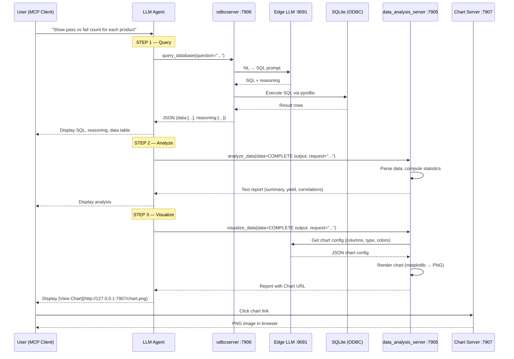

<!--
Copyright (C) 2025 Intel Corporation
SPDX-License-Identifier: Apache-2.0
-->

# MCP Data Analysis Server (`data_analysis_server`)

MCP server that provides statistical analysis and chart visualization for database query results. Runs alongside the ODBC server to form a complete query → analyze → visualize pipeline.

## Tools

| Tool | Description | LLM Needed? |
|------|-------------|-------------|
| `analyze_data` | Statistical analysis: summary stats, distributions, yield analysis, correlations, outliers | No |
| `visualize_data` | Chart generation: bar, line, pie, pareto, boxplot, histogram. Returns HTTP URL to view chart | Yes (for chart config) |

## Ports

| Service | Default Port | Env Variable |
|---------|-------------|--------------|
| MCP Server | `7905` | `MCP_DATA_ANALYSIS_SERVER_PORT` |
| Chart HTTP Server | `7907` | `MCP_CHART_SERVER_PORT` |

## End-to-End Flow (Full 3-Tool Pipeline)

This diagram shows the complete flow from user question through all three tools across both MCP servers:

```
┌─────────────────────────────────────────────────────────────────────────┐
│                         MCP CLIENT (UI)                                 │
│  User types: "Show pass vs fail count for each product"                │
└────────────────────────────┬────────────────────────────────────────────┘
                             │
          ┌──────────────────┼──────────────────────────────┐
          │          STEP 1: QUERY                          │
          │                  │                              │
          │                  ▼                              │
          │  ┌───────────────────────────────────┐          │
          │  │   odbcserver (port 7906)          │          │
          │  │   query_database(question)        │          │
          │  │                                   │          │
          │  │   NL → SQL → ODBC → SQLite        │          │
          │  │         ↕                         │          │
          │  │   Edge LLM (port 9091)            │          │
          │  │                                   │          │
          │  │   Returns:                        │          │
          │  │   {                               │          │
          │  │     "data": [{...}, ...],         │          │
          │  │     "reasoning": {                │          │
          │  │       "generated_sql": "...",     │          │
          │  │       "model_reasoning": "..."    │          │
          │  │     }                             │          │
          │  │   }                               │          │
          │  └──────────────┬────────────────────┘          │
          │                 │                               │
          │     Agent shows: SQL, Reasoning, Data Table     │
          │                 │                               │
          └─────────────────┼───────────────────────────────┘
                            │
                            │  Pass COMPLETE query_database output
                            │
          ┌─────────────────┼───────────────────────────────┐
          │          STEP 2: ANALYZE                        │
          │                 ▼                               │
          │  ┌───────────────────────────────────┐          │
          │  │   data_analysis_server (port 7905)│          │
          │  │   analyze_data(data, request)     │          │
          │  │                                   │          │
          │  │   Pure Python — NO LLM needed     │          │
          │  │                                   │          │
          │  │   • Auto-unwraps {"data":[...]}   │          │
          │  │   • Data overview & shape         │          │
          │  │   • Numeric summary (describe)    │          │
          │  │   • Categorical distributions (%) │          │
          │  │   • Pass/Fail yield analysis      │          │
          │  │   • Correlations                  │          │
          │  │   • Outlier detection (IQR)       │          │
          │  │   • Top/Bottom rankings           │          │
          │  │                                   │          │
          │  │   Returns: text report            │          │
          │  └──────────────┬────────────────────┘          │
          │                 │                               │
          │     Agent shows: Analysis Section               │
          │                 │                               │
          └─────────────────┼───────────────────────────────┘
                            │
                            │  Pass COMPLETE query_database output
                            │
          ┌─────────────────┼───────────────────────────────┐
          │          STEP 3: VISUALIZE                      │
          │                 ▼                               │
          │  ┌───────────────────────────────────┐          │
          │  │   data_analysis_server (port 7905)│          │
          │  │   visualize_data(data, request)   │          │
          │  │                                   │          │
          │  │   • Auto-unwraps {"data":[...]}   │          │
          │  │   • Asks Edge LLM for chart config│          │
          │  │     (or uses heuristic fallback)  │          │
          │  │   • Renders chart with matplotlib │          │
          │  │   • Saves PNG to charts/ dir      │          │
          │  │                                   │          │
          │  │   Returns: report with Chart URL  │          │
          │  └──────────┬──────────┬─────────────┘          │
          │             │          │                        │
          │             │    ┌─────┴──────────────┐         │
          │             │    │ Chart HTTP Server   │         │
          │             │    │ (port 7907)         │         │
          │             │    │ Serves PNG files    │         │
          │             │    │ from charts/ dir    │         │
          │             │    └─────┬──────────────┘         │
          │             │          │                        │
          │     Agent shows:       │                        │
          │       Chart URL ───────┘                        │
          │                                                 │
          └─────────────────────────────────────────────────┘
                            │
                            ▼
┌─────────────────────────────────────────────────────────────────────────┐
│                         MCP CLIENT (UI)                                 │
│                                                                         │
│  **SQL Used:**  SELECT Product, Status, COUNT(*) ...                   │
│  **Reasoning:** Grouped by product and status to get pass/fail...      │
│  **Data:**      | Product | Status | Count |                           │
│                 |---------|--------|-------|                            │
│                 | PCB-A   | Pass   | 142   |                           │
│                 | PCB-A   | Fail   | 8     |                           │
│  **Analysis:**  Yield by product: PCB-A=94.7%, PCB-B=91.2%...        │
│  **Chart:**     [View Chart](http://127.0.0.1:7907/chart_xxx.png)     │
│                                                                         │
│  User clicks link → browser opens chart image                          │
└─────────────────────────────────────────────────────────────────────────┘
```

## Sequence Diagram (Full Pipeline)



## Architecture

```
┌──────────────┐     ┌──────────────────┐     ┌──────────────────────────┐
│              │     │                  │     │                          │
│  MCP Client  │◄───►│  odbcserver      │◄───►│  Edge LLM (llama.cpp)   │
│  (UI/Agent)  │     │  :7906           │     │  :9091                   │
│              │     │  query_database  │     │  Qwen3 8B               │
│              │     │       │          │     │                          │
└──────┬───────┘     └───────┼──────────┘     └──────────┬───────────────┘
       │                     │                           │
       │                     ▼                           │
       │             ┌──────────────┐                    │
       │             │ SQLite DBs   │                    │
       │             │ (via ODBC)   │                    │
       │             │ databases/   │                    │
       │             └──────────────┘                    │
       │                                                 │
       │             ┌──────────────────┐                │
       ├────────────►│ data_analysis_   │◄───────────────┘
       │             │ server :7905     │    (chart config only)
       │             │                  │
       │             │ analyze_data     │
       │             │ visualize_data   │
       │             │       │          │
       │             └───────┼──────────┘
       │                     │
       │                     ▼
       │             ┌──────────────────┐
       │             │ Chart HTTP       │
       └────────────►│ Server :7907     │
        (click URL)  │ serves charts/  │
                     └──────────────────┘
```

## Key Files

| File | Purpose |
|------|---------|
| `server.py` | MCP server entry point, tool registration, chart HTTP server, server lifecycle |
| `analysis_tools.py` | `analyze_data` tool — pure Python statistical analysis (no LLM) |
| `visualization_tools.py` | `visualize_data` tool — chart config via LLM + matplotlib rendering |

## Data Flow Between Tools

The key design principle: **pass COMPLETE tool outputs between tools** — the agent does not extract or transform data.

```
query_database output ──────► analyze_data(data=COMPLETE JSON)
       │                           │
       │                           ▼
       │                      Auto-unwraps {"data":[...]}
       │                      Runs statistical analysis
       │
       └────────────────────► visualize_data(data=COMPLETE JSON)
                                   │
                                   ▼
                              Auto-unwraps {"data":[...]}
                              Gets chart config from LLM
                              Renders PNG with matplotlib
                              Returns HTTP URL
```

## Configuration

| Env Variable | Default | Description |
|-------------|---------|-------------|
| `MCP_DATA_ANALYSIS_SERVER_PORT` | `7905` | MCP server port |
| `MCP_DATA_ANALYSIS_SERVER_PROTOCOL` | `http` | Protocol: `http`, `sse`, or `stdio` |
| `MCP_CHART_SERVER_PORT` | `7907` | Chart image HTTP server port |
| `LLAMA_CPP_URL` | `http://127.0.0.1:9091/v1` | Edge LLM endpoint (used by `visualize_data` for chart config) |

## Start

```powershell
cd mcp_data_analysis_server
.\run.ps1
# or
.\venv\Scripts\python.exe server.py start
```

On startup, the server will:
1. Start the MCP server on port 7905
2. Start the Chart HTTP server on port 7907
3. Register tools: `analyze_data`, `visualize_data`

## Verify Chart Server

After starting, verify the chart HTTP server works:

```bash
curl http://127.0.0.1:7907/
```

Should return an HTML directory listing. After running a visualization, chart PNG files will appear at:
```
http://127.0.0.1:7907/chart_YYYYMMDD_HHMMSS_N_type.png
```

## Supported Chart Types

| Type | Use Case |
|------|----------|
| `bar` | Comparisons across categories |
| `grouped_bar` | Multi-series category comparison |
| `stacked_bar` | Part-to-whole across categories |
| `pareto` | Sorted bars + cumulative % line |
| `line` | Trends over time |
| `pie` | Proportions/distributions |
| `boxplot` | Statistical spread / min-avg-max |
| `histogram` | Frequency distributions |

## Test Queries

Use these with the full 3-tool pipeline:

```
Show pass vs fail count for each product
What is the yield rate for each test station?
Show daily test volume over time
Which process steps have the highest failure rate?
Show the top 5 stations with most failures
```
