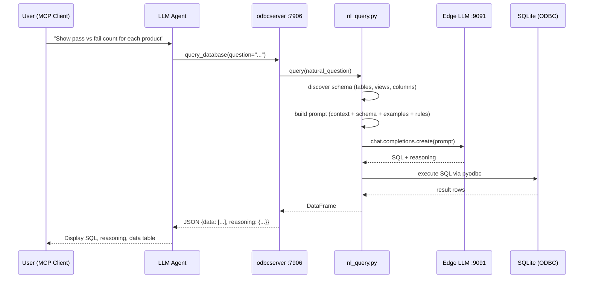

<!--
Copyright (C) 2025 Intel Corporation
SPDX-License-Identifier: Apache-2.0
-->

# MCP ODBC Server (`odbcserver`)

MCP server that converts natural language questions into SQL queries, executes them against SQLite databases via ODBC, and returns structured JSON results.

## Tool

| Tool | Description |
|------|-------------|
| `query_database` | Accepts a natural language question, converts it to SQL using a local LLM, executes via ODBC, and returns data + reasoning as JSON. |

## Ports

| Service | Default Port | Env Variable |
|---------|-------------|--------------|
| MCP Server | `7906` | `MCP_ODBCSERVER_PORT` |

## End-to-End Flow

```
┌─────────────────────────────────────────────────────────────────────────┐
│                         MCP CLIENT (UI)                                 │
│  User types: "Show pass vs fail count for each product"                │
└────────────────────────────┬────────────────────────────────────────────┘
                             │
                             │  MCP call: query_database(question="...")
                             ▼
┌─────────────────────────────────────────────────────────────────────────┐
│                    ODBCSERVER  (port 7906)                              │
│                                                                         │
│  ┌──────────────────────────────────────────────────────────────────┐   │
│  │ 1. SCHEMA DISCOVERY                                              │   │
│  │    SchemaDiscovery scans all .sqlite files in databases/         │   │
│  │    → tables, views, columns, types, PKs, FKs                    │   │
│  │    → cached after first run                                      │   │
│  └──────────────────────────┬───────────────────────────────────────┘   │
│                              ▼                                          │
│  ┌──────────────────────────────────────────────────────────────────┐   │
│  │ 2. NL → SQL CONVERSION  (nl_query.py)                           │   │
│  │    Builds prompt:                                                │   │
│  │      • Domain context (FCT manufacturing)                       │   │
│  │      • Compact schema (inline column format)                    │   │
│  │      • Example Q→SQL pairs                                      │   │
│  │      • Rules (no IsDelete, use views, etc.)                     │   │
│  │                                                                  │   │
│  │    Sends to Edge LLM  ──────►  llama.cpp (port 9091)           │   │
│  │                           ◄──────  SQL + reasoning              │   │
│  └──────────────────────────┬───────────────────────────────────────┘   │
│                              ▼                                          │
│  ┌──────────────────────────────────────────────────────────────────┐   │
│  │ 3. SQL EXECUTION  (query_databases.py)                          │   │
│  │    pyodbc → SQLite ODBC Driver → databases/*.sqlite             │   │
│  │    → DataFrame result                                            │   │
│  └──────────────────────────┬───────────────────────────────────────┘   │
│                              ▼                                          │
│  ┌──────────────────────────────────────────────────────────────────┐   │
│  │ 4. RESPONSE ASSEMBLY                                             │   │
│  │    {                                                             │   │
│  │      "data": [ {row1}, {row2}, ... ],                           │   │
│  │      "reasoning": {                                              │   │
│  │        "generated_sql": "SELECT ...",                            │   │
│  │        "model_reasoning": "I chose this approach because...",    │   │
│  │        "question": "Show pass vs fail...",                       │   │
│  │        "databases_queried": ["sophic"]                           │   │
│  │      }                                                           │   │
│  │    }                                                             │   │
│  └──────────────────────────┬───────────────────────────────────────┘   │
└─────────────────────────────┼───────────────────────────────────────────┘
                              │
                              │  JSON response
                              ▼
┌─────────────────────────────────────────────────────────────────────────┐
│                         MCP CLIENT (UI)                                 │
│  Agent displays:                                                        │
│    • SQL Used                                                           │
│    • Model Reasoning                                                    │
│    • Data Table                                                         │
└─────────────────────────────────────────────────────────────────────────┘
```

## Sequence Diagram



## Key Files

| File | Purpose |
|------|---------|
| `server.py` | MCP server entry point, `query_database` tool definition, server lifecycle |
| `nl_query.py` | Schema discovery, NL→SQL prompt engineering, LLM interaction |
| `query_databases.py` | ODBC connection management, SQL execution, multi-database support |

## Configuration

| Env Variable | Default | Description |
|-------------|---------|-------------|
| `MCP_ODBCSERVER_PORT` | `7906` | MCP server port |
| `MCP_ODBCSERVER_PROTOCOL` | `http` | Protocol: `http`, `sse`, or `stdio` |
| `LLAMA_CPP_URL` | `http://127.0.0.1:9091/v1` | Edge LLM endpoint (OpenAI-compatible) |

## Start

```powershell
cd mcp_odbcserver
.\run.ps1
# or
.\venv\Scripts\python.exe server.py start
```

## Test Queries

```
Show all products
How many test stations are there?
Show pass and fail counts by product
Which process steps have the highest failure rate?
```
