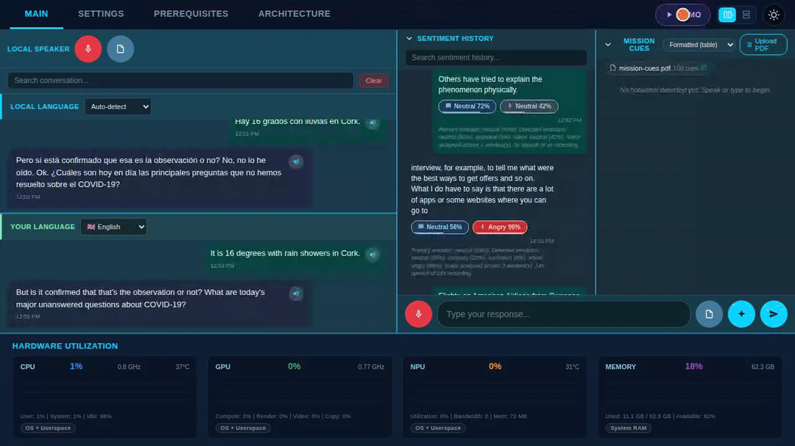
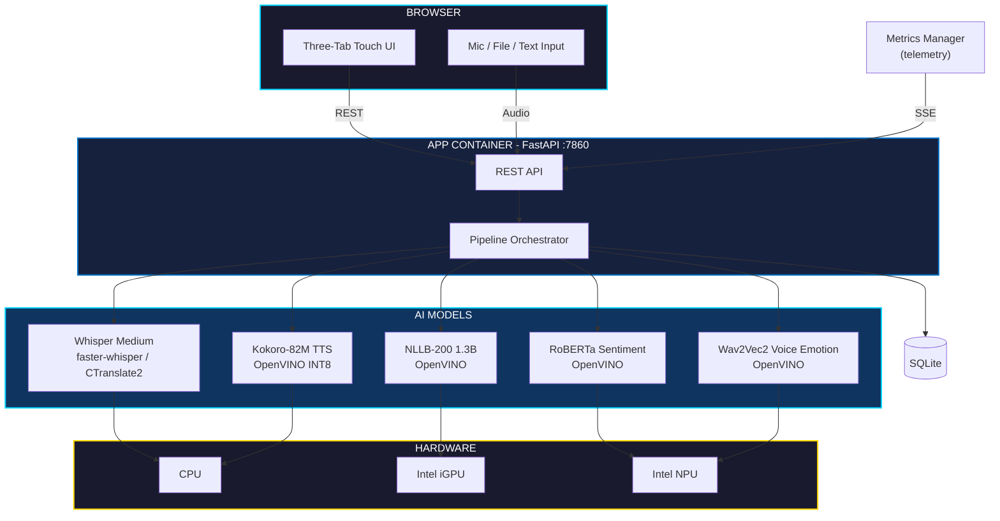

# Local Lingua

> **Notice:** This software is currently in pre-production status, designed to run locally on a single system for a single user only.

Local Lingua is a sample application for offline voice translation and sentiment analysis. No cloud, no internet at runtime — all inference runs on local CPU, GPU, and NPU.



## Features

- Bidirectional translation (local speaker <-> user) in 15+ languages
- Real-time transcription with native script support (Devanagari, Arabic, CJK, Cyrillic)
- Combined sentiment: text analysis + voice tone detection (angry, happy, sad, calm, etc.)
- Text-to-speech on every chat bubble
- Hardware telemetry graphs (CPU/GPU/NPU) via Intel metrics-manager
- Searchable conversation and sentiment history
- First-use model download from HuggingFace
- Touch-optimized dark UI for tablet form factor

## Requirements

- Intel® Core™ Ultra Series 3 processor (Products formerly Panther Lake)
- Latest [Ubuntu* 24.04 LTS Desktop](https://releases.ubuntu.com/noble/). Refer to [Ubuntu Desktop installation tutorial](https://ubuntu.com/tutorials/install-ubuntu-desktop#1-overview) if needed.
- Docker* installed — see the [official Docker installation guide](https://docs.docker.com/engine/install/ubuntu/)
- Internet for initial model download

## Quick Start

Run from `samples/ai/local-lingua/`:

```bash
./setup.sh       # Required, one-time: installs dependencies, downloads AI models, builds the image (needs internet)
./start.sh       # Start via Docker (exposes localhost:7860) — fast, image already built
./stop.sh        # Stop the running app
./uninstall.sh   # Optional: remove models/venv/data for a clean re-test of setup
```

`setup.sh` prompts to optionally download demo voice samples too; pass `--demo`/`--no-demo`
to skip the prompt (e.g. for unattended/CI runs). Safe to re-run — already-installed
packages and downloaded models are skipped. For finer-grained control (checking
prerequisites, full reset, etc.), see [Advanced: Make Targets](#advanced-make-targets).

## Architecture



## AI Pipeline

Audio input triggers all stages — voice emotion runs **in parallel** with translation for zero added latency:

```
Audio ──→ Whisper (CPU) ──→ Transcribed Text ──┬──→ NLLB Translation (GPU) ──→ Sentiment (NPU)
                                               └──→ Voice Emotion (NPU)  ────────────┘
                                                                                     ↓
                                                                              Fused Result
```

| Stage | Model | Device | Time |
|-------|-------|--------|------|
| Transcription | openai/whisper-medium | CPU | ~2-5s |
| Translation | facebook/nllb-200-distilled-1.3B | GPU | ~200ms |
| Sentiment | cardiffnlp/twitter-roberta-base-sentiment-latest | NPU | ~6ms |
| Voice Emotion | ehcalabres/wav2vec2-lg-xlsr-en-speech-emotion-recognition | NPU | ~96ms |
| TTS | tngtech/Kokoro-82M-int8-ov | CPU | ~1-2s |

All models selectable per-stage in the Settings tab. Device target (CPU/GPU/NPU) configurable at runtime.

## NPU Acceleration

Sentiment analysis and voice emotion detection run on Intel NPU by default. Models are exported with static input shapes for NPU compilation compatibility. The NPU utilization is visible in the hardware monitoring graphs.

## Advanced: Make Targets

`setup.sh`/`start.sh`/`stop.sh`/`uninstall.sh` are thin wrappers around these `make` targets,
available for finer-grained control (`sudo apt-get install make` if not already installed):

| Target | Description |
|--------|-------------|
| `make prereq` | Required, one-time: system packages, Python venv, model download, image build |
| `make demo-prereq` | Optional: downloads demo voice samples, enables the in-app Demo button |
| `make check` | Verify prerequisites |
| `make build` | (Re)build the app image without starting it |
| `make run` | Start the app (fast — pass `REBUILD=1` to force a rebuild) |
| `make stop` | Stop containers |
| `make clean` | Full reset (models, venv, data) |
| `make demo-clean` | Remove demo artifacts only |
| `make help` | List all available commands |

`make demo-prereq` skips work already done (existing voice samples / Mission Cues PDF);
pass `FORCE=1` to force a refresh.
