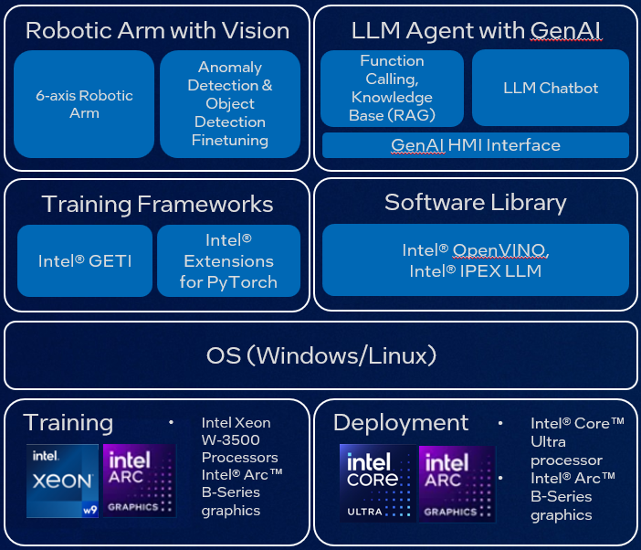
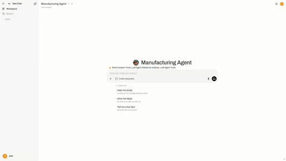
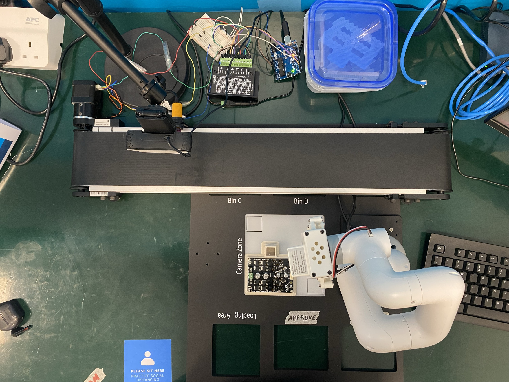
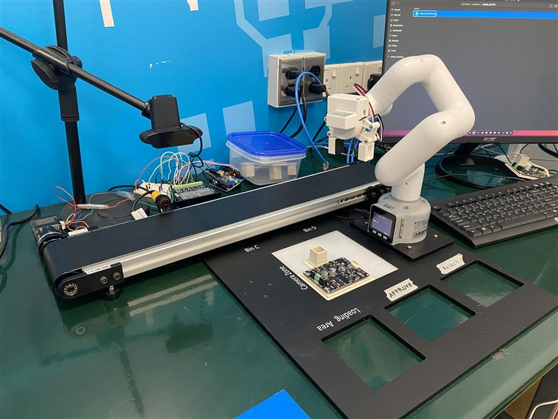

<!-- Copyright (C) 2025 Intel Corporation -->
<!-- SPDX-License-Identifier: Apache-2.0  -->

# Manufacturing HMI with LLM & GenAI

## Description

**Manufacturing HMI with LLM & GenAI** is a comprehensive system that simulates a real-world PCB manufacturing environment. The system is responsible for providing insights and analytics into defects detected on PCB boards using a combination of computer vision, robotic automation, and LLM-based agent reasoning.





The **app** directory contains the main logic responsible for running the robotic arm, conveyor belt, and exposing a variety of APIs. These APIs allow the LLM agent to control the robotic arm, trigger visual inspections, and obtain analytics and statistics about the inspection results. The robotic arm is controlled through the main app's interface, while the conveyor belt is driven by a motor controller (Arduino) that listens for commands via a serial connection. The motor driver is controlled by an Arduino script, which ensures smooth operation of the conveyor system.

The LLM agent operates separately from the main app but interacts with it using specific tools that trigger the appropriate API endpoints based on user prompts. This means that while the main app controls the entire robotic and visual inspection process, the LLM agent only needs to call the relevant APIs to control and obtain data from the system.

The setup mimics a production line with the following key components:

- **Robotic Arm** (Elephant Robotics myCobot 280): Performs pick-and-place tasks.
- **Conveyor Belt System** (Dobot Mini Conveyor Kit): Transports PCB boards through different stages.
- **Defect Detection Model**: Inspects and classifies the PCB boards.
- **Database**: Stores inspection results and metadata.
- **Decision Agent**: Directs robotic actions based on inference outcomes (pass/fail).
- **Web Interface**: Displays a live camera feed and the latest inference result.
- **LLM Agent** (via OpenWebUI): Controls the robot, triggers inspections, gathers statistics, and provides a knowledge base interface.

This project blends robotics, AI, and modern web technologies to provide a high-fidelity simulation of an intelligent manufacturing environment.

---

## Quick Start

### System Requirements

**Software:**
- Ubuntu 22
- Docker
- Python 3.10
- Arduino IDE or CLI (for firmware)

**Hardware:**
- Elephant Robotics myCobot 280 M5Stack
- Dobot Mini Conveyor Belt Kit
- TB6600 Arduino Stepper Motor Driver
- Arduino Uno
- Webcam

**Ports Used:**
- `8000` – Robotic Application (FastAPI)
- `80` – LLM Agent (OpenwebUI)
- `27017` - Database (MongoDB)

---

### Hardware Setup Instructions

1. **Setup Hardware**

This is how the hardware should be set up for the robotic arm, conveyor belt, and other peripherals. Refer to the following images for correct physical arrangement:

**Top View:**



**Side View:**



---

2. **Pin Connections**

Refer to the following tables for pin configurations.

#### Stepper Motor → TB6600 Driver

| Stepper Motor Pin | TB6600 Terminal |
|-------------------|-----------------|
| 1                 | A+              |
| 4                 | A−              |
| 3                 | B−              |
| 6                 | B+              |

---
#### TB6600 Driver → Arduino

| TB6600 Terminal | Arduino Pin |
|----------------|-------------|
| ENA−           | GND         |
| ENA+           | D8          |
| DIR−           | GND         |
| DIR+           | D2          |
| PUL−           | GND         |
| PUL+           | D5          |

---
#### TB6600 Driver → Power Supply (12V DC)

| TB6600 Terminal | Power Supply |
|----------------|----------------|
| GND            | 12V (−)        |
| VCC            | 12V (+)        |

---
3. **Connecting Arduino and Robotic Arm**

- Connect both the **Arduino board** and **robotic arm** to your computer using USB cables.
- Once connected, select **USB UART mode** on the robotic arm’s transponder screen.
- If the screen displays `Atom: ok`, the device is successfully connected.

> **Note:**  
> The **Arduino** does not need to be connected to an external power supply—it draws power via USB.  
> The **robotic arm** does not require calibration unless necessary.

### Geti Model Setup Instructions

1. Setup Geti using instructions found [here](https://github.com/open-edge-platform/geti?tab=readme-ov-file)

2. Train an object detection model to detect defects commonly found on a PCB board

3. Save the model in the `app\detection_model` folder.

### Software Setup Instructions

#### App Setup
1. **(Recommended) Create a virtual environment**

Ubuntu 22.04

```bash
cd app
python3.10 -m venv venv
source venv/bin/activate
pip install -r requirements.txt
```

Ubuntu 24.04

Install [conda-forge](https://conda-forge.org/download/)
```bash
cd app
conda create --name manufacturing-agent python=3.10
conda activate manufacturing-agent
pip install -r requirements.txt
```

2. **Copy and Configure `config.py`**

```bash
cd app/core
cp config.py.template config.py
# Open config.py and modify the necessary configurations like serial ports or hardware parameters
```

3. **Add USB Udev Rules for Serial Communication**

```bash
check_and_create_udev_rule() {
    local RULES_FILE="/etc/udev/rules.d/99-mydevice.rules"
    local RULE1='SUBSYSTEMS=="usb", ATTRS{idVendor}=="2341", GROUP="plugdev", MODE="0666"'
    local RULE2='SUBSYSTEM=="tty", ATTRS{idVendor}=="1a86", ATTRS{idProduct}=="55d4", MODE="0666"'

    if [ ! -f "$RULES_FILE" ]; then
        echo "File does not exist. Creating it with both rules..."
        {
            echo "$RULE1"
            echo "$RULE2"
        } | sudo tee "$RULES_FILE" > /dev/null
        echo "File created with both rules."
    else
        local UPDATED=0

        if ! grep -Fxq "$RULE1" "$RULES_FILE"; then
            echo "Adding missing rule 1..."
            echo "$RULE1" | sudo tee -a "$RULES_FILE" > /dev/null
            UPDATED=1
        fi

        if ! grep -Fxq "$RULE2" "$RULES_FILE"; then
            echo "Adding missing rule 2..."
            echo "$RULE2" | sudo tee -a "$RULES_FILE" > /dev/null
            UPDATED=1
        fi

        if [ $UPDATED -eq 0 ]; then
            echo "All rules are already present."
        else
            echo "Rules updated in the file."
        fi
    fi
}
check_and_create_udev_rule
sudo udevadm control --reload-rules
sudo udevadm trigger
```

4. **Load the Conveyor Belt Arduino Script**

To get the conveyor belt motor system running, you will need to load the provided Arduino script onto the Arduino board. This script ensures the motor driver is properly controlled via serial commands from the main app.

**Steps:**

1. Open the Arduino IDE and load the script from `scripts/conveyor_belt.ino`.
2. Connect the Arduino board to your computer via USB.
3. Select the correct board and port in the Arduino IDE.
4. Click **Upload** to load the script onto the Arduino board.

> **Note**: The Arduino will remember the script after it is uploaded, so you don't need to re-upload it after every reboot unless the Arduino is reset.

5. **Start the Database using Docker Compose**

```bash
cd app
docker compose up -d
```
This will start the database container defined in the `docker-compose.yml` file.

6. **Start the Application**

With the virtual environment activated:

```bash
cd app
fastapi run app.py --port 8000
```

The app should now be running at `http://localhost:8000`.

---

### Populate the Database

After launching the application, manually run a few PCB inference cycles using the web interface or a script (e.g., trigger via API or LLM agent).

This will generate real inspection results and populate the database.

> **Note**: A synthetic data generator is currently in development and will be included in a future update.

---

### LLM Agent Setup (OpenWebUI)

1. **Navigate to the LLM setup folder**

```bash
cd edge-developer-kit-reference-scripts/usecases/ai/openwebui-ollama
```

2. **Follow the README inside to launch OpenWebUI**

All required tools, prompts, and LLM agent assets are located in the `assets/configs` folder.

Once launched, OpenWebUI should be accessible at `http://localhost:80`.

---
