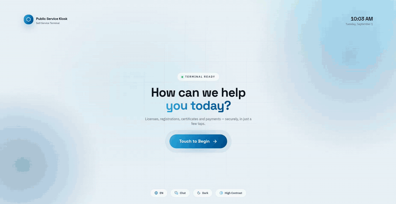

<div align="center">

# 🏛️ Vertical Reference Solutions Blueprint

**A vertical reference solutions blueprint for edge AI applications, shipping a sample
public-service kiosk — touch, chat and voice-agent terminals with identity
verification, document scanning and AI-powered service flows, running fully on
local hardware.**

[Getting Started](docs/getting-started.md) · [Dev Mode](docs/dev-mode.md) · [Build](docs/build.md) · [Configuration](docs/configuration.md) · [Release Notes](docs/release-notes.md)



<sub>The touch terminal, end to end — identity check, documents, payment, receipt.</sub>

</div>

---

## ⚡ Quick start

```bash
./setup.sh      # one time: installs the kiosk frontend's dependencies
./start.sh      # builds (if needed) and serves the kiosk at http://localhost:3000
```

On Windows, run the `_win.bat` of the same name — the suffix keeps them apart
from the `.sh` scripts when Explorer hides file extensions. Each one launches
the matching `scripts\win\*.ps1` with the execution policy bypassed for that
process only:

```bat
setup_win.bat
start_win.bat
```

Both scripts expect the **Edge AI Studio** (the AI gateway) checkout at
`EDGE_AI_STUDIO_DIR` and fail if it is missing: setup sets it up (long: models,
toolchains), start launches it and waits for its gateway. Skip it on a terminal that
talks to a gateway running elsewhere — the kiosk then uses whatever is live at
`STUDIO_URL` and reports the rest on its health page:

```bash
./setup.sh --skip-studio  # kiosk dependencies only
./start.sh --no-studio    # serve against whatever gateway is live
```

No AI gateway at all? Run everything mocked:

```bash
./start.sh --mock
```

| Script | Windows | What it does | Doc |
|---|---|---|---|
| `./setup.sh` | `setup_win.bat` | One-time install: the kiosk frontend's deps and the Edge AI Studio (`--skip-studio` to leave it out); optional peripheral drivers (`--hardware`) | [getting-started.md](docs/getting-started.md) |
| `./start.sh` | `start_win.bat` | Normal start: brings the Edge AI Studio gateway up (`--no-studio` to skip), then the production kiosk server on :3000 | [getting-started.md](docs/getting-started.md) |
| `./scripts/dev/dev.sh` | `scripts\dev\dev.bat` | Development: hot reload, `--mock` for zero-dependency UI work, `--desktop` for the desktop shell | [dev-mode.md](docs/dev-mode.md) |
| `./scripts/dev/update.sh` | `scripts\dev\update.bat` | Mirror this checkout into another directory (non-gitignored files only, minus `.git`, `.claude` and the update scripts) | [dev-mode.md](docs/dev-mode.md) |
| `./scripts/build.sh` | `scripts\build.bat` | Production build: the embedded bundle as a desktop app on Linux (.AppImage/.deb → `build/`); the standalone desktop app (.exe/.msi) on Windows. Installs the `electron/` deps itself; `./setup.sh --build` runs setup and this in one go | [build.md](docs/build.md) |
| `./uninstall.sh` | `uninstall_win.bat` | Remove an installed app; `--data` also removes what it wrote (database, documents, unpacked platform) | [build.md](docs/build.md) |

Every script takes `--help`, and the flags are spelled the same on both platforms.

---

## ⭐ What's inside

A citizen walks up, verifies their identity (NFC ID card + face match), submits
documents (scanner, upload or mocks), pays, and gets a receipt — through one of three
terminal styles:

- **Touch** — classic guided screens
- **Chat** — conversational flow with voice in/out
- **Agent** — an LLM agent driving the kiosk's services over MCP

| Component | Path | Stack |
|---|---|---|
| Kiosk app (UI + API + admin) | [frontend/](frontend/) | Next.js 16, React 19, Tailwind 4, Vercel AI SDK, MCP |
| Admin dashboard / citizen registry | `/admin` route | Payload CMS 3 on SQLite (auto-created & seeded with 100 synthetic citizens) |
| Staff registration desk | `/enroll` route | Enroll citizens, bind NFC cards, capture portraits |
| Desktop shell | [electron/](electron/) | Electron — packages the server into a fullscreen AppImage/deb, running it on the shell's own Node |
| Country pack (Malaysia) | [frontend/src/packs/malaysia/](frontend/src/packs/malaysia/) | Everything country-shaped: the 10 folder-defined services with their flow planners, ID documents & copy, speech vocabulary, NLU keywords — a second country is a sibling pack |
| Peripheral drivers | [frontend/src/app/api/_lib/peripherals/](frontend/src/app/api/_lib/peripherals/) | Driver contract + registry for NFC and the scanner; per-model scanner quirks are pluggable profiles |
| Mock data | [assets/](assets/), [frontend/data/](frontend/data/) | Synthetic citizens, ID cards, scannable documents |

### 🧠 The AI prerequisite: Edge AI Studio

All AI features are HTTP calls to the **Edge AI Demo Studio** gateway on
`localhost:8080` — LLM (text-generation), OCR (PaddleOCR), face recognition,
speech-to-text and text-to-speech. The launcher scripts build and start it for you,
and install the deployment profile matching your kiosk mode as its `deployment.json`
so the right services auto-start with the right model and devices — `touch` mode
runs OCR and face only ([studio-deployment.touch.json](scripts/studio-deployment.touch.json)),
leaving text-generation to a **remote** gateway that `llm.base_url` points at;
`chat`/`agent` modes run all five locally ([studio-deployment.chat.json](scripts/studio-deployment.chat.json)).
Its location is configurable:

```bash
# .kioskrc (gitignored) — or export as env vars
EDGE_AI_STUDIO_DIR="../edge-ai-demo-studio"
```

See [getting-started.md](docs/getting-started.md#the-edge-ai-studio-prerequisite)
for making its services auto-start; its own `scripts/bash/package.sh` packages it
into a distributable executable.

---

## 📥 Installation

**Requirements:** Node.js ≥ 20 (or let `./setup.sh` fetch a portable one) · Linux (Debian/Ubuntu; Windows supported for the
desktop build via `electron\build.ps1`) · an [Edge AI Studio] checkout for live AI
(optional — everything falls back to mocks).

```bash
./setup.sh                   # standard
./setup.sh --yes             # non-interactive
./setup.sh --hardware        # + peripheral drivers: pcscd (NFC), SANE + PFU pfufs (scanner), poppler (OCR)
./setup.sh --package-studio  # + build the studio's distributable executable
./setup.sh --build           # kiosk dependencies, then the production build — the studio is not set up
```

The studio setup is for running the kiosk natively from this checkout. A build
machine only needs the studio *checkout* (the build exports the bundle from it),
so `--build` skips the studio setup unless you also pass `--studio`.

---

## 🖥️ Running

| Goal | Command |
|---|---|
| Run the kiosk (normal) | `./start.sh` · `start_win.bat` |
| Run the packaged desktop app | `./start.sh --desktop` · `start_win.bat --desktop` |
| Develop with hot reload | `./scripts/dev/dev.sh` · `scripts\dev\dev.bat` |
| Desktop shell in dev mode | `./scripts/dev/dev.sh --desktop` · `scripts\dev\dev.bat --desktop` |
| Package the kiosk app (embedded bundle) | `./scripts/build.sh` (non-interactive: `-- --yes --targets=appimage,deb`) · from a fresh clone: `./setup.sh --build [-- …]` |
| Package the kiosk app on Windows | `scripts\build.bat` (non-interactive: `-- --yes --targets=nsis`) · `setup_win.bat --build [-- …]` |
| Run the bundle from the checkout | `./setup.sh --bundle` |
| Run the embedded bundle | `./start.sh --bundle` (add `--desktop` for a desktop window) |
| Run without any AI gateway | `./start.sh --mock` / `./scripts/dev/dev.sh --mock` |
| Uninstall an installed terminal | `./uninstall.sh --dry-run` then `./uninstall.sh [--data]` · `uninstall_win.bat` |

The embedded bundle (`--bundle`) is exported by `scripts/bundle.mjs`, one Node
script shared by both platforms (`scripts/bundle.sh` is its bash wrapper), so
`setup_win.bat --bundle` and `start_win.bat --bundle` work the same as their
bash counterparts.

**Live by default.** Every script sets up and runs the real stack — live AI services
via the studio, real scanner/NFC hardware when attached. Mocks are used only when
you explicitly pass `--mock` (or when a device is physically absent, so the flow can
still complete).

Key URLs once running: kiosk **:3000**, admin **:3000/admin**
(`admin@demo.local`, with the password the launcher generated on first run and
printed — `cms.admin_password` in the gitignored `frontend/config.yaml`), staff desk
**:3000/enroll**, health **:3000/api/health**, studio gateway **:8080**.

---

## 🔧 Configuration

Settings resolve as **env vars → `frontend/config.local.yaml` → `frontend/config.yaml`
→ code defaults**. `config.yaml` is this terminal's own, gitignored copy — the launchers
create it from [frontend/configs/](frontend/configs/) on the first run. The committed
[frontend/configs/reference.yaml](frontend/configs/reference.yaml) documents
every option inline; the full reference — AI endpoints, NFC reader, document scanner,
session timing, CMS credentials, prompt overrides, launcher variables — is in
**[docs/configuration.md](docs/configuration.md)**.

A handful of settings are baked in at build time (terminal mode, document source,
country pack and locale, reader gesture); everything else is changeable on the
terminal with a restart. See
[configuration.md § Build-time vs runtime](docs/configuration.md#build-time-vs-runtime-settings).

---

## 🌏 Country packs & localisation

The kiosk ships with a **Malaysia** pack, but nothing about a country is
hardwired: identity documents and what they are called, the on-screen and
spoken copy, the speech-recognition vocabulary, the assistant's keyword
routing and the service catalog itself all live in a **country pack**
([frontend/src/packs/](frontend/src/packs/)), selected with `country.pack` in
config.yaml. Formatting (currency, dates, clock) comes from the `locale:`
block. Adding Vietnamese — or any other country — is a new pack directory
plus four one-line registrations: the contract and checklist are in
**[docs/country-packs.md](docs/country-packs.md)**, and the translation
layer's rules in **[docs/i18n.md](docs/i18n.md)**.

---

## 🔌 Peripherals

The kiosk currently drives three peripherals. All are optional — every device is
simulated when absent, so the full flow runs on a laptop:

| Peripheral | Reference hardware | Interface / driver | What the kiosk does with it |
|---|---|---|---|
| **NFC ID card reader** | ACS ACR122U (contactless pad or contact slot) | PC/SC via `pcscd` / `libpcsclite1`, Node bindings [pcsc-mini](https://npmjs.com/package/pcsc-mini) | Reads the ID card's serial (APDU `FF CA 00 00 00`) and looks the citizen up in the registry. Probe with `npm run nfc:probe` |
| **Document scanner** | Ricoh/PFU **fi-800R** | SANE `scanimage` with PFU's proprietary **`pfufs`** backend (fi Series Linux driver, which also ships the `pfufsgetscstatus` paper-detect tool) | Duplex ADF batch scan of the citizen's paperwork, packed into one PDF per document |
| **Webcam** | any UVC webcam | browser `getUserMedia` — no driver package needed | Face verification against the enrolled portrait; portrait capture at the staff desk |

The NFC daemon and the SANE frontend come from apt; the `pfufs` scanner backend
is a licensed download from PFU. Install all of them with the driver script:

```bash
(cd frontend && npm run drivers:install)     # or ./setup.sh --hardware
```

Which driver runs each device is configuration, not code: `nfc.driver`
(`pcsc` | `mock`), `documents.scanner.driver` (`sane` | `mock`) and
`documents.scanner.profile` (how the scanner reports "paper loaded" —
`fi-800r`, or `none` for scanners without a status tool, including SANE's
virtual `test:0`). A different scanner model means a new status profile in
[peripherals/scanner-profiles.ts](frontend/src/app/api/_lib/peripherals/scanner-profiles.ts),
not a fork of the driver. `/api/health` reports both peripherals.

Setup details: [frontend/README.md](frontend/README.md#peripheral-drivers) and
[docs/configuration.md](docs/configuration.md#hardware).

---

## 📚 Documentation

| Doc | Contents |
|---|---|
| [docs/getting-started.md](docs/getting-started.md) | Setup + normal start, the studio prerequisite, health checks, troubleshooting |
| [docs/dev-mode.md](docs/dev-mode.md) | Dev server, mock mode, DB resets, tests, useful commands |
| [docs/build.md](docs/build.md) | Web build, desktop (Electron) packaging, studio executable, terminal deployment |
| [docs/embedded-studio.md](docs/embedded-studio.md) | All-in-one bundle: minimal studio with the kiosk embedded as a studio sample |
| [docs/configuration.md](docs/configuration.md) | Every configuration option and env var |
| [docs/country-packs.md](docs/country-packs.md) | Country packs: what one owns, registration points, adding a country |
| [docs/i18n.md](docs/i18n.md) | The translation layer: what goes through `t()`, formats, matching |
| [frontend/README.md](frontend/README.md) | App architecture, service flows, adding services, backend swapping |
| [electron/README.md](electron/README.md) | Desktop packaging internals |
| [frontend/tests/README.md](frontend/tests/README.md) | End-to-end test suite |

[Edge AI Studio]: docs/getting-started.md#the-edge-ai-studio-prerequisite
