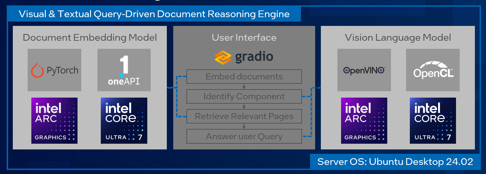

<!-- Copyright (C) 2025 Intel Corporation -->
<!-- SPDX-License-Identifier: Apache-2.0  -->
# Visual Textual Query-driven Document Reasoning Engine

## Overview

The Visual Textual Query-driven Document Reasoning Engine is an AI-powered tool that combines Vision-Language Models (VLMs) with document retrieval capabilities to enable intelligent, context-aware querying of technical documentation. This engine allows users to ask natural language questions about complex visual and textual content within PDF documents, with support for component identification through image uploads.



### Key Features

- **Multi-modal Document Retrieval**: Indexes PDF documents using advanced vision-language embeddings for semantic search
- **Component-based Querying**: Upload images of specific components to retrieve relevant documentation pages
- **Intelligent Visual Understanding**: Automatically identifies components from images and matches them against predefined taxonomies
- **Agentic Response Generation**: Provides contextual, page-specific answers based on retrieved documentation
- **Hardware Acceleration**: Optimized for Intel hardware (iGPU/dGPU) using OpenVINO and PyTorch XPU
- **Interactive Web Interface**: User-friendly Gradio-based UI with query history and visual feedback
- **Configurable Use Cases**: Easily adaptable to different domains (e.g., robotics manuals, IPC regulations, safety documentation)

### Use Cases

The engine is designed to be domain-agnostic and can be configured for various applications:
- **Industrial Equipment Manuals**: Query robotic arm operation guides, safety procedures, and maintenance instructions
- **Electronic Standards Compliance**: Navigate IPC regulations and component specifications
- **Technical Documentation**: Search through complex visual-heavy manuals with natural language
- **Training and Support**: Enable field technicians to quickly find relevant information using component photos


## Verified Configurations
The following hardware and OS configurations have been tested and verified:

- **Arrow Lake - H (iGPU)**
   - Intel(R) Core(TM) Ultra 9 285H
   - 64 GB RAM
   - 1 TB storage
   - Ubuntu 24.02
   - Python 3.12

- **Arrow Lake - S (dGPU)**
   - Intel(R) Core(TM) Ultra 9 285
   - 64 GB RAM
   - 1 TB storage
   - Ubuntu 24.02
   - Python 3.12
   - Arc A770 (16GB)

## Prerequisites
Ensure the GPU drivers are installed using the [`gpu_installer.sh`](https://github.com/open-edge-platform/edge-developer-kit-reference-scripts/blob/main/gpu_installer.sh)

## Installation
1. **Install the necessary dependencies.**
   ```bash
   sudo apt update
   sudo apt install -y python3-venv poppler-utils
   ```

2. **Create and activate a Python virtual environment:**
   ```bash
   python3 -m venv .venv
   source .venv/bin/activate
   ```

3. **Install the Python dependencies:**
   ```bash
   pip install -r requirements.txt
   ```
   
4. **Install PyTorch and Intel Extension for XPU support:**
   ```bash
   pip install -U --force-reinstall --no-cache-dir torch torchvision torchaudio --index-url https://download.pytorch.org/whl/xpu   
   ```

5. **Create the config file:**
   Create the `config.py` file by copying the content from `config.py.template` and modify the values to experiment with the tool. Few examples are available in the `./assets/usecases`.

## Usage
1. **Activate the Python virtual environment created earlier (if not activated yet):**
   ```bash
   source .venv/bin/activate
   ```

2. **Run the app using following command:**
   - On Arrow Lake systems without a dGPU:
      ```bash
      unset ONEAPI_DEVICE_SELECTOR && unset OPENVINO_DEVICE && python main.py
      ```
   - On Arrow Lake systems with an A770:
      - to run fully on dGPU:
         ```bash
         ONEAPI_DEVICE_SELECTOR=level_zero:0 OPENVINO_DEVICE=GPU.1 python main.py
         ```
      - to run fully on iGPU:
         ```bash
         ONEAPI_DEVICE_SELECTOR=level_zero:1 OPENVINO_DEVICE=GPU.0 python main.py
         ```

Then open the provided local URL in your browser.
