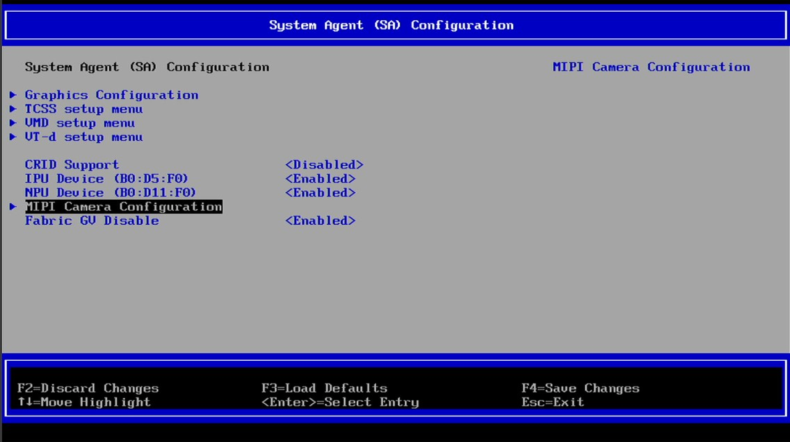
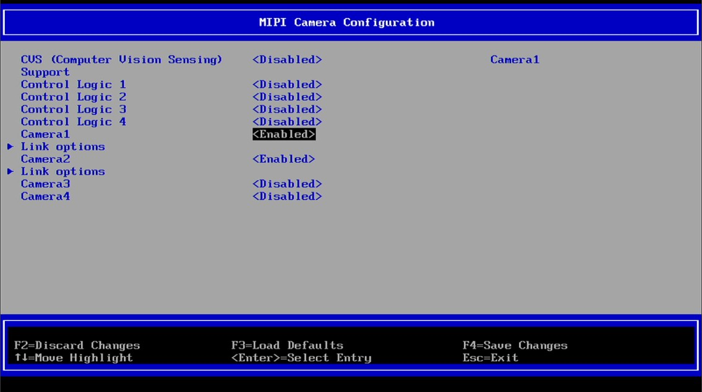

# Innodisk - Intel® Core™ Ultra Series 3 processors (Panther Lake-U/H) GMSL BIOS Configuration

## Hardware Setup and Connections

1. Power off the system and disconnect AC power.
2. Install the GMSL AIC into an appropriate MIPI CSI-2 slot.
3. Connect GMSL cameras to the AIC as recommended in the image below.

4. Reconnect power and boot the system.

This page describes the BIOS configuration steps for the Innodisk platform to enable the IPU7 with GMSL cameras.

> Note: BIOS menus and exact settings vary by platform vendor and camera sensor.

BIOS options are platform-specific. Configure the platform BIOS to enable the IPU7 and the Intel GMSL SERDES ACPI devices as required in the System Agent (SA) Configuration.

1. Enable IPU and NPU device. 

2. Navigate to MIPI Camera Configuration

> Note: Only enable Camera1 for 4 cameras configuration.

3. Enable Camera1 and Camera2 for 8 cameras configuration. 

4. In Camera1 menu, apply all the necessary config for MIPI Port A.

5. In Camera2 menu, apply all the necessary config for MIPI Port C.

6. Press F4 to save the changes and navigate to the main BIOS menu page to continue.
System will go into reboot state.

## Trademarks

Ubuntu* is a trademark of Canonical Ltd.
