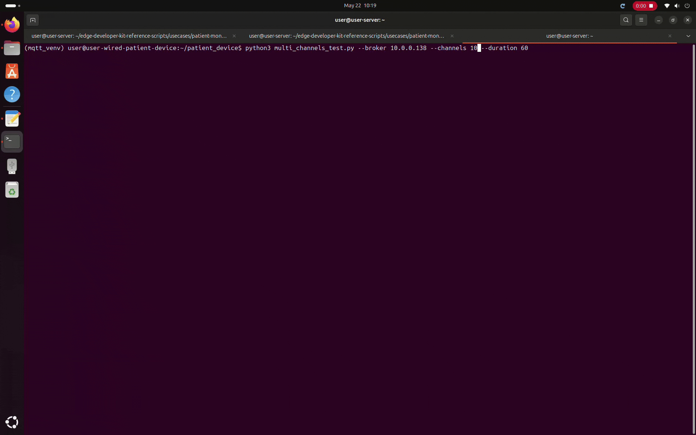
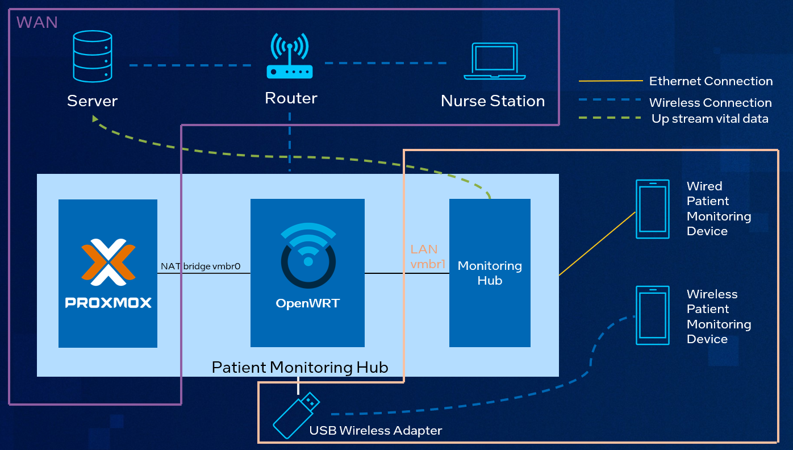

# Patient Monitoring Hub – Reference Implementation

## Table of Contents
- [Overview](#overview)
- [Demo](#demo)
- [Architecture](#architecture)
  - [High-Level Components](#high-level-components)
  - [Proxmox Host](#proxmox-host)
  - [OpenWRT VM](#openwrt-vm)
  - [Monitoring Hub](#monitoring-hub)
  - [Patient Monitoring Devices](#patient-monitoring-devices)
    - [Wired Devices](#wired-devices)
    - [Wireless Devices](#wireless-devices)
  - [Central Monitoring System Server](#central-monitoring-system-server)
- [Data Flow](#data-flow)
  - [Downstream (Patient Monitoring Devices → Monitoring Hub)](#downstream-patient-monitoring-devices--monitoring-hub)
  - [Upstream (Monitoring Hub → Central Monitoring System Server)](#upstream-monitoring-hub--central-monitoring-system-server)
- [Validated Hardware and Benchmark Results](#validated-hardware-and-benchmark-results)
  - [Validated System Components](#validated-system-components)
  - [Network Components](#network-components)
  - [Latency Benchmark Summary](#latency-benchmark-summary)
- [Get Started](#get-started)
- [Known Limitations](#known-limitations)

---

## Overview

> **Ready to deploy?** Jump directly to [Get Started](#get-started)

The Patient Monitoring Hub is a **virtualized edge solution** designed to collect, process, and forward patient vital signs from monitoring devices to backend systems and nurses station dashboards.

This solution demonstrates:
- Real-time patient data ingestion from connected devices  
- Edge-based processing and aggregation  
- Upstream data forwarding to central systems  
- Support for both wired and wireless device connectivity
- Support for touchless sensor connectivity  

The entire stack runs on a **Proxmox virtualized environment**, leveraging:
- **OpenWRT Virtual Machine (VM)** for network routing and DHCP service  
- **Ubuntu LXC container** as the monitoring hub  
- **MQTT** messaging protocol for lightweight and fault-tolerant data streaming
- **InfluxDB** database designed to handle huge volumes of continuous data stream  

---

## Demo

---

## Architecture

    <em>Architecture diagram</em> 

The system is deployed within a **single-node virtualized edge environment**.

### High-Level Components
- **OpenWRT VM** – Network routing and DHCP services  
- **Monitoring Hub (Ubuntu LXC container)** – Data ingestion, processing, and forwarding  
- **Patient Monitoring Devices** – Wired and wireless endpoints publishing data  
- **Central Monitoring System Server** – Centralized database server

---

### Proxmox Host

The Proxmox host provides the virtualization layer and network isolation for the Patient Monitoring Hub.

**Network Configuration:**
- `vmbr0` – WAN / NAT bridge  
  - Subnet: `192.168.100.0/24`  
  - Used as OpenWRT WAN interface  

- `vmbr1` – LAN bridge  
  - Virtual switch for local external devices (patient monitoring devices)
  - Subnet: `10.0.0.0/24`  

- **USB Wireless Adapter**
  - Passed through to OpenWRT
  - Acts as a Wireless Access Point  

- **Physical NIC (`nic0`)**
  - Attached to `vmbr1`
  - Enables external wired devices to join LAN  

---

### OpenWRT VM

The OpenWRT virtual machine on Proxmox Host  acts as the **network gateway** within the Patient Monitoring Hub.

**Interfaces:**
- `eth0` → `vmbr0` (WAN)  
  - Static IP: `192.168.100.50`  
  - Provides upstream network access  

- `eth1` → `vmbr1` (LAN)  
  - IP: `10.0.0.1`  
  - Default gateway for LAN devices  

- `br-lan`  
  - Includes USB Wi-Fi adapter  
  - Provides Wireless Access Point functionality  

**Key Functions:**
- DHCP server for LAN (`10.0.0.0/24`)  
- NAT and routing to upstream network  
- Connectivity between isolated LAN and external network  

---

### Monitoring Hub

The Monitoring Hub on Proxmox Host (Patient Monitoring Hub) is deployed as a **lightweight Ubuntu LXC container**.

**Core Services:**
- MQTT broker (device message ingestion)  
- InfluxDB (time-series database)  
- Python processing service:
  - Consumes MQTT messages  
  - Writes to local InfluxDB database 
  - Forwards data to upstream server 

**Network:**
- IP assigned via DHCP (10.0.0.x)
- Default gateway: OpenWRT (10.0.0.1)

---

### Patient Monitoring Devices

Patient Monitoring Devices are external Patient Monitors that publish vital-sign telemetry to the Monitoring Hub over MQTT. Devices connect to the local LAN either via wired Ethernet or wirelessly through the OpenWRT Access Point.

#### Wired Devices
- Connected via physical NIC to Proxmox host  
- Join LAN (`10.0.0.0/24`) via `vmbr1`  
- Publish data directly to Monitoring Hub via MQTT  

#### Wireless Devices
- Connected via Wi-Fi AP (OpenWRT)  
- Join LAN (`10.0.0.0/24`)  
- Publish MQTT data to Monitoring Hub  

---

### Central Monitoring System Server

The Central Monitoring System Server is a dedicated server that serves as the central data ingest and storage endpoint for patient telemetry forwarded from the Monitoring Hub.

**Core Services:**
- InfluxDB (time-series database, running in Docker)  
- Receives upstream patient telemetry from the Monitoring Hub  

**Network:**
- Must be network-reachable from the Monitoring Hub  
- Should use the same subnet as the Proxmox host during initial setup  

---

## Data Flow

### Downstream (Patient Monitoring Devices → Monitoring Hub)
1. Devices publish data via MQTT  
2. Monitoring Hub receives messages  
3. Python service processes and stores data in InfluxDB  
4. Data available locally for analysis  

### Upstream (Monitoring Hub → Central Monitoring System Server)
1. Monitoring Hub sends processed data upstream  
2. Traffic routed via OpenWRT gateway  
3. OpenWRT forwards traffic to hospital network (e.g. Medical Device Network)  
4. Data reaches centralized database server

---

## Validated Hardware and Benchmark Results

### Validated System Components

| Component | Model | Processor | Memory | OS |
|----------|------|----------|--------|----|
| Patient Monitoring Hub | ASUS IoT PE2300U | Intel® Core™ Ultra 7 265U | 32GB | Debian 13 + Proxmox VE 9.1.0 |
| Wired Device | ASRock iEP-7020E | Intel® Core™ i7-1370PRE | 32GB | Ubuntu 24.04 |
| Wireless Device | Intel® NUC11PAHi7 | Intel® Core™ i7-1165G7 | 32GB | Ubuntu 24.04 |
| Central Monitoring System Server | Intel® NUC11PAHi7 | Intel® Core™ i7-1165G7 | 64GB | Ubuntu 24.04 |
| Nurses Station | Intel® NUC13RNGi9 | Intel® Core™ i9-13900K | 32GB | Ubuntu 24.04 |

> ASUS IoT PE2300U Ethernet driver setup: [Download Link](https://www.asus.com/networking-iot-servers/aiot-industrial-solutions/embedded-computers-edge-ai-systems/pe2300u/helpdesk_download?model2Name=PE2300U)

---

### Network Components

| Component | Model | Interface | Notes |
|----------|------|-----------|------|
| Router | Asus RT-AX86U | 1Gbps | Upstream gateway |
| USB Wi-Fi Adapter | MediaTek MT7612U | USB 2.0 | AP mode supported |

---

### Latency Benchmark Summary

Benchmark configuration:
- Duration: 120 seconds  
- Channel count: 1, 10, 20, 30  
- Default MQTT settings

| Channel Count | Wired Patient Monitoring Device  to Server Latency (s) | Wireless Patient Monitoring Device  to Server Latency (s) |
|---------------|-------------------------------|----------------------------------|
| 1             | Average : 0.181 s  Typical (p50): 0.161 s  95% of msgs ≤ : 0.354 s  99% of msgs ≤ : 0.467 s | Average : 0.109 s  Typical (p50): 0.088 s  95% of msgs ≤ : 0.184 s  99% of msgs ≤ : 0.382 s |
| 10            | Average : 0.128 s  Typical (p50): 0.123 s  95% of msgs ≤ : 0.193 s  99% of msgs ≤ : 0.220 s | Average : 0.113 s  Typical (p50): 0.079 s  95% of msgs ≤ : 0.301 s 99% of msgs ≤ : 0.369 s |
| 20            | Average : 0.215 s  Typical (p50): 0.205 s  95% of msgs ≤ : 0.390 s  99% of msgs ≤ : 0.479 s | Average : 0.211 s  Typical (p50): 0.107 s  95% of msgs ≤ : 0.749 s  99% of msgs ≤ : 1.186 s |
| 30            | Average : 0.209 s  Typical (p50): 0.205 s  95% of msgs ≤ : 0.334 s  99% of msgs ≤ : 0.397 s |  Average : 0.836 s  Typical (p50): 0.758 s  95% of msgs ≤ : 1.929 s  99% of msgs ≤ : 2.167 s |

**Key Observations:**
- Stable latency under moderate load (≤20 channels)  
- Wireless latency increases significantly at high channel count (30)  
- Multi-channel testing simulates concurrent patient vital data streams  

Latency metrics:
- **Average:** Mean latency  
- **p50:** Median latency  
- **p95:** 95th percentile  
- **p99:** Worst-case latency  

---

## Get Started

Follow the setup steps in sequence:

1) [Setup Proxmox Host](./docs/proxmox_setup.md)
2) [Setup OpenWRT VM](./docs/openwrt_setup.md)
3) [Setup Central Monitoring System Server](./docs/server_setup.md)
4) [Setup Monitoring Hub (Ubuntu LXC)](./docs/monitoring_hub_setup.md)
5) [Connect and Configure Patient Monitoring Device](./docs/patient_device.md)
6) [Setup Nurses Station Dashboard](./docs/nurse_dashboard.md)
7) [Run End-to-End Workflow](./docs/end_to_end_workflow.md)

---

## Known Limitations

This reference implementation is intended for demonstration, evaluation and benchmarking purposes. Current limitations include:

- **No disconnection alerts**  
  Loss of connectivity from patient monitoring devices or hub is not detected or notified  

- **No transport security (MQTT)**  
  MQTT messages are transmitted in plaintext  
  - No TLS encryption  
  - No device authentication (mTLS)  

- **No strict message guarantees**  
  - Duplicate or out-of-order messages may occur  
  - No correction or deduplication mechanisms  

---

## Disclaimer

This solution is a **reference implementation** and is not intended for direct clinical deployment without appropriate validation, security hardening, and regulatory compliance.

---