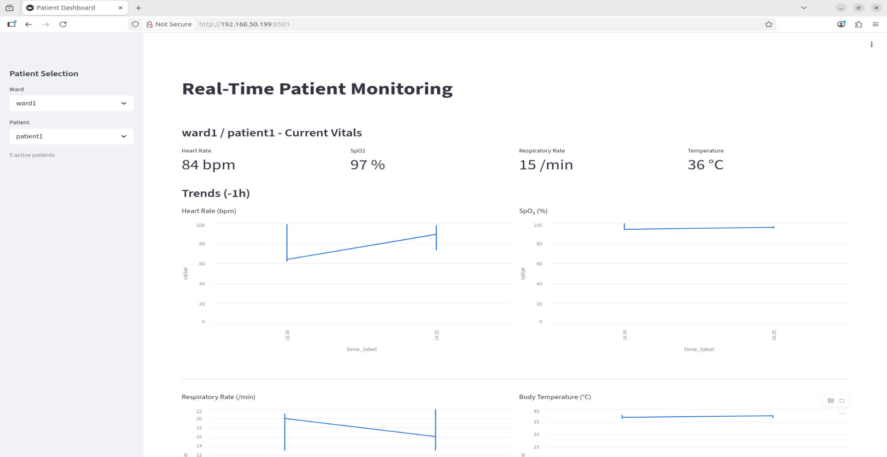

# Setup Nurses Station Dashboard

## Overview

This guide explains how to setup a Nurses Station Dashboard. This dashboard is a Streamlit application that reads patient vitals from the server InfluxDB instance and displays real-time metrics and trends for selected ward and patient.

## Table of Contents

- [Prerequisites](#prerequisites)
- [Get Started](#get-started)
- [Configure Server InfluxDB Connection](#configure-server-influxdb-connection)
- [Launch Dashboard](#launch-dashboard)
- [Verify After Setup](#verify-after-setup)
- [Example Dashboard](#example-dashboard)
- [Next Step](#next-step)

## Prerequisites

1. Ubuntu 24.04 system.
2. Server setup completed and `SERVER_TOKEN` available from [Setup Central Monitoring System Server](./server_setup.md).

## Get Started

1. Clone repository:

   ```bash
   git clone https://github.com/open-edge-platform/edge-developer-kit-reference-scripts
   ```

2. Change directory:

   ```bash
   cd edge-developer-kit-reference-scripts/samples/patient-monitoring-hub/scripts/nurse_dashboard
   ```

3. Run setup script:

   ```bash
   bash setup.sh
   ```

4. Activate virtual environment:

   ```bash
   source nurse_dashboard/bin/activate
   ```

## Configure Server InfluxDB Connection

Edit `nurse_dashboard.py` and update:

```python
INFLUX_URL = "http://<SERVER_IP>:8086"
INFLUX_TOKEN = "<TOKEN>"
```

## Launch Dashboard

Run:

```bash
streamlit run nurse_dashboard.py
```

Then open:

`http://<SYSTEM_IP>:8501`

## Verify After Setup

Expected result:

- Streamlit starts without Python import errors.
- Browser opens dashboard page at `http://<SYSTEM_IP>:8501`.
- Ward and patient selections appear after data is available.
- Current vitals and trend charts update automatically.

If no data appears:

- Confirm patient device publisher is running from [Connect and Configure Patient Monitoring Device](./patient_device.md).
- Confirm server InfluxDB is running from [Setup Central Monitoring System Server](./server_setup.md).
- Re-check `INFLUX_URL` and `INFLUX_TOKEN` values.

## Example Dashboard



## Next Step
[Run End-to-End Workflow](./end_to_end_workflow.md) 