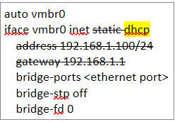
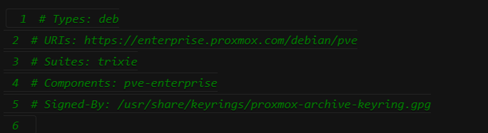
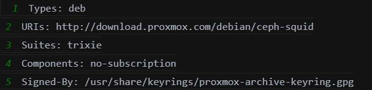

# Setup Proxmox Host

## Overview

This guide explains how to setup Proxmox on Patient Monitoring Hub.

## Table of Contents

- [Hardware Requirements](#hardware-requirements)
- [Get Started](#get-started)
- [What proxmox_setup.sh Does](#what-proxmox_setupsh-does)
- [End Result Network Setup](#end-result-network-setup)
  - [Wired Ethernet Setup](#wired-ethernet-setup)
  - [Wireless Setup](#wireless-setup)
- [Resulting Network Layout](#resulting-network-layout)
- [Next Step](#next-step)

## Hardware Requirements

- System with either a WiFi module or a wired Ethernet connection
- USB Wireless Adapter plug in system

## Get Started

1. Download the Proxmox VE ISO from https://www.proxmox.com/en/downloads/proxmox-virtual-environment/iso and write it to a USB flash drive.

2. Boot the system from the USB flash drive and complete the Proxmox VE installation.

3. Connect the system to the wired network. All users must complete this step first — it provides internet access for installing packages and the APT source updates required by Proxmox.

    > **Note for ASUS IoT PE2300U users:** Ethernet drivers installation refer to this [link](https://www.asus.com/networking-iot-servers/aiot-industrial-solutions/embedded-computers-edge-ai-systems/pe2300u/helpdesk_download?model2Name=PE2300U).
    - Download to your system and unzip.
    - `cd OmniEdge.Linux.amd64.V.1.1.6/OmniEdge_1.1.6_amd64_20250604/omniedge/OmniEdge_amd64_V1.1.6/OmniEdge`
    - `dpkg -i omniedge_1.1.6_amd64.deb` <br>
    **The driver version available for download may differ from the example shown above.

    <a id="wired-setup"></a>
    **Wired Ethernet setup (required for all users)**

    - i. Plug in an Ethernet cable.
    - ii. Edit `/etc/network/interfaces`:
       - Change `static` to `dhcp`.
       - Remove the `address` and `gateway` lines.
       - Replace the interface name with your connected port (for example `nic0` or `nic1`). <br>
         
    - iii. Restart the network service:
       ```bash
       systemctl restart networking
       ```
       This assigns an IP address to `vmbr0`.

    - iv. Edit `/etc/apt/sources.list.d/pve-enterprise.sources`
      - Add `#` at the beginning of each line <br>
         

    - v. Edit `/etc/apt/sources.list.d/ceph.sources`
         - Update to this
         - Change `https://enterprise.proxmox.com/debian/ceph-squid` to `http://download.proxmox.com/debian/ceph-squid`
         - Change Components to `no-subscription` <br>
            

4. **(Optional) Switch to Wireless (WiFi) uplink.** Skip this step if you are staying on the wired connection.

    <details>
    <summary><b>Expand for wireless setup steps</b></summary>

    Complete step 3 (Wired Ethernet setup) first so the packages below can be installed.

    - i. Install the Wi-Fi packages:
      ```bash
      apt update
      apt install -y iw wpasupplicant rfkill
      ```
    - ii. You can now unplug the Ethernet cable.
    - iii. Open the network interfaces file:
       ```bash
       vi /etc/network/interfaces
       ```
    - iv. Add your WiFi interface (run `ip link show` to get the WiFi interface name; this example uses `wlp2s0`):
       ```
       auto wlp2s0
       iface wlp2s0 inet dhcp
           wpa-ssid "YourSSID"
           wpa-psk "YourPassword"
       ```
    - v. Update the `vmbr0` block from
       ```
       auto vmbr0
       iface vmbr0 inet dhcp
           bridge-ports nic1
           bridge-stp off
           bridge-fd 0
       ```
       to this
       ```
       iface vmbr0 inet manual
       ```
    - vi. Save and exit (`Esc`, then `:wq`).
    - vii. Bring up the interface:
       ```bash
       ifreload -a
       systemctl restart networking
       ```
    - viii. Verify the connection:
       ```bash
       ip addr show wlp2s0      # Check IP address
       ping 8.8.8.8            # Test internet access
       ```

    </details>

5. Git clone repository

    ```bash
    apt update
    apt install git
    git clone https://github.com/open-edge-platform/edge-developer-kit-reference-scripts
    ```

6. cd  `edge-developer-kit-reference-scripts/samples/patient-monitoring-hub/scripts`

7. Run the setup from the local console as `root`.

    ```bash
    bash proxmox_setup.sh
    ```

    !! Do not run this script through SSH. The script may change the host bridge configuration, which can interrupt remote access during setup.

8. Review the summary printed by the script and reboot when prompted.

9. To access Proxmox web UI `http://<Proxmox_IP_Address>:8006`

## What `proxmox_setup.sh` Does

The `proxmox_setup.sh` script prepares the Proxmox host for the Patient Monitoring Hub network layout.

It performs the following actions:

1. Installs required networking packages and persistence tools (`iw`, `wpasupplicant`, `rfkill`, `iptables-persistent`, and `netfilter-persistent`).
2. Ensures `vmbr1` exists for the OpenWRT LAN side.
3. Detects whether a wired uplink is active.
4. If wired uplink is active, creates or migrates `vmbr0_ethernet` as the host WAN uplink bridge while keeping `vmbr0` reserved for the NAT network.
5. Persists and applies IPv4 forwarding using `/etc/sysctl.d/99-openwrt-forwarding.conf`.
6. Adds host forwarding and NAT rules so host TCP port `8080` forwards to OpenWRT (`192.168.100.50:80`) through the active uplink; this port is used later to access the OpenWRT web UI.
7. Saves iptables rules, prints a setup summary, and prompts for reboot.

## End Result Network Setup

### Wired Ethernet Setup

| Layer | Configuration |
|-------|----------------|
| **WAN Uplink** | `vmbr0_ethernet` (migrated from default `vmbr0`; physical NIC auto-detected) |
| **NAT Gateway** | `vmbr0`: `192.168.100.1/24` |
| **OpenWRT VM** | Connected to `vmbr0` → gets IP `192.168.100.50` |
| **OpenWRT LAN** | `vmbr1` bridge for LAN port |
| **Port Forwarding** | Host `8080` → VM `192.168.100.50:80` |
| **Masquerading** | All traffic from VM out via `vmbr0_ethernet` |

### Wireless Setup

| Layer | Configuration |
|-------|----------------|
| **WAN Uplink** | `wlan0` (direct connection, no separate bridge) |
| **NAT Gateway** | `vmbr0`: `192.168.100.1/24` |
| **OpenWRT VM** | Connected to `vmbr0` → gets IP `192.168.100.50` |
| **OpenWRT LAN** | `vmbr1` bridge for LAN port |
| **Port Forwarding** | Host `8080` → VM `192.168.100.50:80` |
| **Masquerading** | All traffic from VM out via `wlan0` |

## Resulting Network Layout

After the script completes, the host is intended to use this layout:

- `vmbr0`: reserved for the NAT bridge network `192.168.100.0/24`
- `vmbr1`: reserved for the OpenWRT LAN side
- `vmbr0_ethernet`: WAN uplink bridge when the host is connected through wired Ethernet
- Wireless interface: WAN uplink when the host is connected through WiFi

## Next Step

[Setup OpenWRT VM](./openwrt_setup.md)
