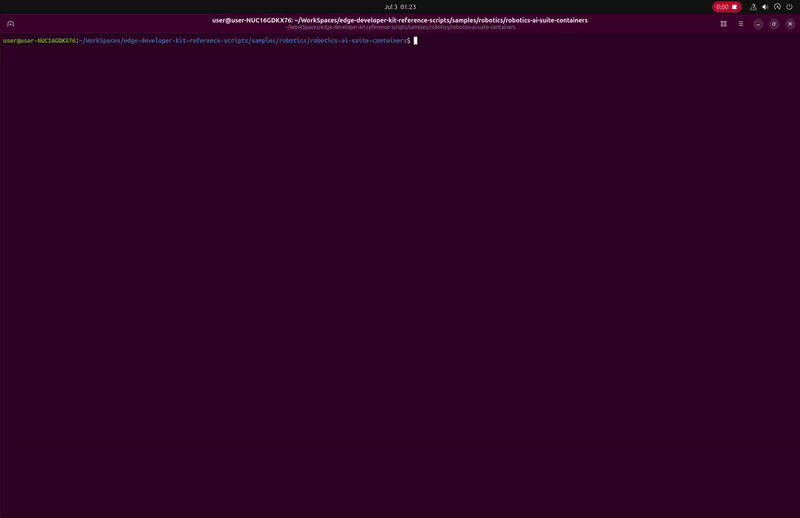

# Robotics AI Suite Containers

This sample provides scripts to build and run containerized Robotics AI Suite modules from the [Robotics AI Suite](https://github.com/open-edge-platform/edge-ai-suites/tree/main/robotics-ai-suite) repository on Intel® hardware. It supports the following modules:

- **autonomous-mobile-robot**: Collaborative visual SLAM and wandering app simulation samples.
- **humanoid-imitation-learning**: ACT and PI0.5 RTC-OV imitation learning samples.
- **stationary-robot-vision-control**: Robot vision control sample that requires a physical robot.



## Recommended hardware

* Intel Core Ultra Series 3
* 32GB RAM

## Prerequisite
1. Install the latest [Ubuntu* 24.04 LTS Desktop](https://releases.ubuntu.com/noble/). Refer to the [Ubuntu Desktop installation tutorial](https://ubuntu.com/tutorials/install-ubuntu-desktop#1-overview) if needed.

2. Install the required drivers by running the installer script. Reboot the system after the installation complete.
    ```bash
    sudo bash -c "$(wget -qLO - https://raw.githubusercontent.com/open-edge-platform/edge-developer-kit-reference-scripts/refs/heads/main/main_installer.sh)"
    ```

3. Install Docker and Docker Compose before running the commands below. Refer to the [Docker installation guide](https://docs.docker.com/engine/install/) for setup instructions. Add your user to the `docker` group, then restart the system for the changes to take effect.

4. Git is required to clone the repository:
    ```bash
    sudo apt install git
    ```

## Quick Start

1. Clone this repository and navigate to the sample directory:
    ```bash
    git clone https://github.com/open-edge-platform/edge-developer-kit-reference-scripts.git
    cd edge-developer-kit-reference-scripts/samples/robotics/robotics-ai-suite-containers
    ```

2. Run the setup script to clone the `edge-ai-suites` repository and build the Docker image for your chosen module and sample. Follow the interactive prompts to select a module (`autonomous-mobile-robot`, `humanoid-imitation-learning`, or `stationary-robot-vision-control`) and, if applicable, a sample.
    ```bash
    ./setup.sh
    ```


3. Run the container for the selected module and sample. Select the same module and sample used during setup. The script launches the container with GPU and display access configured automatically, and opens a shell inside the container.
    ```bash
    ./run.sh
    ```


4. Inside the container, run the sample using `launch_sample.sh`. Follow the interactive prompts to select the sample, inference device, and rendering options, or pass them as arguments (see `./launch_sample.sh --help`).
    ```bash
    ./launch_sample.sh
    ```


## Limitation

1. On **Intel Core Ultra Series 2** platforms, if you encounter the `CL_OUT_OF_RESOURCES` error while running on the integrated GPU, add the kernel parameter `xe.force_probe=7d51` to your GRUB configuration.