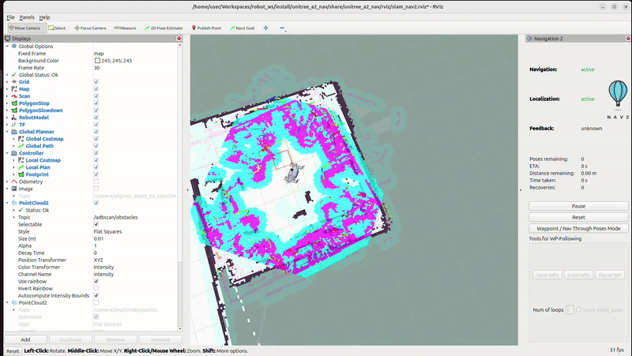
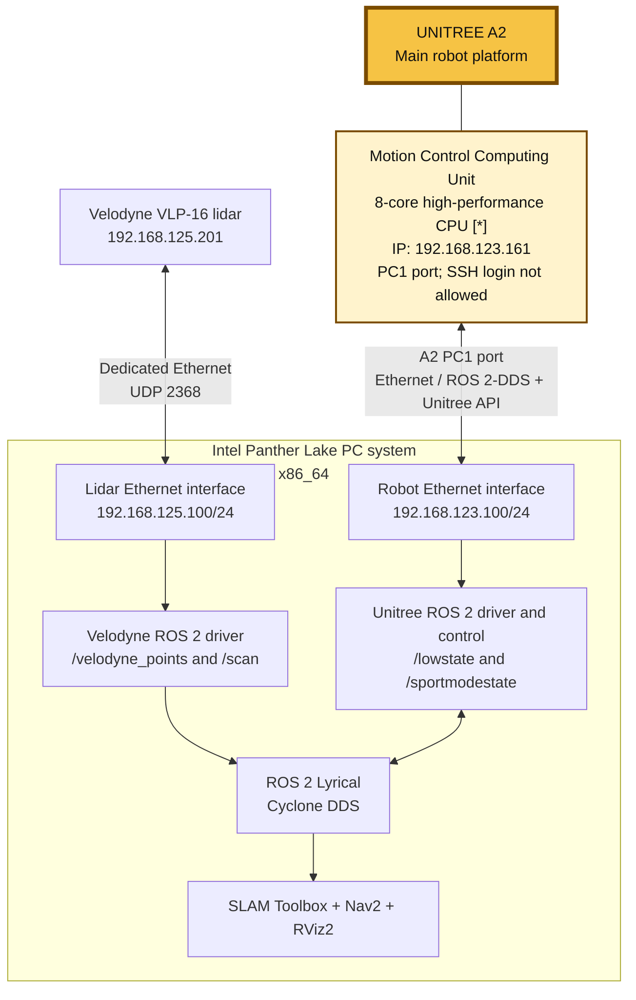

# Unitree A2 ROS 2 Workspace

ROS 2 workspace for operating and visualizing a Unitree A2 quadruped. The
workspace combines Unitree state and control interfaces with a robot model,
sensor drivers, SLAM Toolbox, Nav2, and RViz2.

The repository includes a reproducible setup script for **RHEL 10 on
x86_64**. The script installs the ROS and native dependencies, checks out the
external source repositories, applies the project patches, builds the
workspace, configures Cyclone DDS, and validates the resulting installation.

## Demo



## What is included

| Package | Purpose |
| --- | --- |
| `unitree_a2_ros2` | A2 URDF and meshes, `robot_state_publisher` launch, low-state to `JointState` bridge, sport-state to odometry/IMU bridge, sensor configuration, and RViz layouts. |
| `unitree_a2_control` | C++ Unitree sport client examples and the `/cmd_vel` bridge used to send velocity commands to the robot. |
| `unitree_a2_nav` | SLAM Toolbox and Nav2 launch files, navigation parameters, and the mapping RViz configuration. |
| `unitree_ros2` | Unitree ROS 2 message and API packages used by the local packages. |

The setup process also obtains external sources for:

- Velodyne and YDLIDAR ROS 2 drivers
- SLAM Toolbox and `robot_localization`
- Navigation2 and Nav2 minimal TurtleBot simulation sources
- Cyclone DDS and the Cyclone DDS RMW implementation
- YDLIDAR SDK, Ceres Solver, OMPL, and GeographicLib

## Repository layout

```text
.
├── patches/                  # Compatibility patches for external sources
├── script/
│   └── setup_ros2_lyrical_rhel10.sh
├── sources.lock              # Pinned external repository commits
├── src/
│   ├── unitree_a2_control/
│   ├── unitree_a2_nav/
│   ├── unitree_a2_ros2/
│   └── unitree_ros2/
└── setup.txt                 # Historical/manual setup notes
```

The setup script clones additional repositories into `src/`. Keep the
`patches/` directory, `sources.lock`, and the Unitree packages in this
workspace before running it.

## Requirements

- RHEL 10, x86_64
- A sudo-capable user
- A connected Ethernet interface for the robot and/or lidar
- Unitree A2 hardware and its ROS 2 message/API packages
- A supported lidar configuration, such as the VLP-16 settings in
  `src/unitree_a2_ros2/config/`
- A graphical session if RViz2 is required

The setup script uses `dnf`, `subscription-manager`, EPEL, and the RHEL
CodeReady Builder repository. It is intentionally not a generic Ubuntu or
other-distribution installer.

## System architecture

The Intel Panther Lake system is the ROS 2 host. Use separate physical
Ethernet interfaces for the Velodyne lidar and the Unitree A2 so lidar UDP
traffic does not interfere with the robot-facing Cyclone DDS interface.



The Unitree A2 is the central robot platform: the Panther Lake PC provides
ROS 2 computation, visualization, navigation, and control, while the
Velodyne provides lidar data to the PC for the A2's mapping and navigation
stack. The lidar link uses the `192.168.125.0/24` subnet, while the
robot-facing interface uses the `192.168.123.0/24` subnet. The A2 Motion
Control Computing Unit is at `192.168.123.161` and communicates through the
A2's **PC1** port. Do not attempt SSH access; SSH login is not allowed.

The rendered version below adds the supplied hardware images to the same
architecture:


## Prerequisites before installation

The RHEL system must have an active Red Hat subscription before the setup
script can enable repositories and install packages.

If you already have a Red Hat account and an active subscription, continue
with the commands below. If you do not have a Red Hat account, register at the
[Red Hat Developer program](https://developers.redhat.com/register), sign in,
and accept the terms for the no-cost [Red Hat Developer Subscription for
Individuals](https://developers.redhat.com/articles/faqs-no-cost-red-hat-enterprise-linux).
This subscription is intended for individual development, testing, and small
production use; review Red Hat's current terms to confirm that it fits your
use case.

After the subscription is active, connect the RHEL system to Red Hat Hybrid
Cloud Console and update the system packages:

```bash
sudo rhc connect
sudo dnf update -y
```

Complete the authentication and subscription prompts shown by `rhc connect`,
using the Red Hat account that has the Individual Developer Subscription. The
`rhc connect` command registers the system and enables access to Red Hat
content repositories.

The setup script also runs `sudo dnf update -y` as part of its installation
process, but the prerequisite update ensures the system is registered and
current before dependencies are installed.

## Physical hardware network setup

Configure the computer's Ethernet connections with manual/static IPv4
settings before starting the robot or lidar drivers. The values below assume
the robot and Velodyne use separate Ethernet interfaces.

### Kernel and DDS notes

- If the system is using the **RHEL 6.17.047 kernel**, the DRM graphics stack
  may fail. This can prevent graphical applications such as RViz2 from
  starting correctly. Check the active kernel with `uname -r` and use a
  compatible kernel or graphics configuration if this occurs.
- DDS interface selection should be treated as order-dependent: DDS may use
  the first available LAN/network interface when no interface is explicitly
  constrained. As a best practice, connect the Unitree robot to the first LAN
  or network interface on the system, so ROS 2 traffic is selected on the
  expected network.
- The setup script prompts you to select the Ethernet interface for Cyclone
  DDS. Select the robot-facing first LAN interface when prompted, and keep the
  Velodyne on its separate interface if you are using separate robot and lidar
  networks.

### Robot Ethernet interface

In the network settings for the Ethernet connection going to the Unitree
robot, set IPv4 to **Manual** and use:

| Setting | Value |
| --- | --- |
| Address | `192.168.123.100` |
| Prefix/netmask | `24` / `255.255.255.0` |
| Gateway | Leave blank unless your robot network requires one |
| DNS | Leave blank unless your robot network requires one |

Use the robot's configured IP address when testing the connection. Do not
assign the robot-facing interface the same address as the robot.

### Velodyne Ethernet interface

In the network settings for the Ethernet connection going to the VLP lidar,
set IPv4 to **Manual** and use:

| Setting | Value |
| --- | --- |
| Computer address | `192.168.125.100` |
| Prefix/netmask | `24` / `255.255.255.0` |
| Gateway | Leave blank |
| DNS | Leave blank |
| Velodyne device address | `192.168.125.201` |

The default Velodyne configuration already expects the device at
`192.168.125.201`:

```yaml
# src/unitree_a2_ros2/config/velodyne_vlp16.yaml
device_ip: 192.168.125.201
port: 2368
```

If the lidar has a different IP, set the computer's lidar-facing interface to
an address in the same subnet and update `device_ip` in
`src/unitree_a2_ros2/config/velodyne_vlp16.yaml` to match. The computer and
the lidar must be on the same Ethernet link/subnet.

Verify the physical links before launching ROS 2:

```bash
ip addr
ping -c 3 192.168.125.201
```

If the robot uses a separate Ethernet interface, test it with the robot's
actual IP address:

```bash
ping -c 3 <ROBOT_IP>
```

When the setup script asks which interface Cyclone DDS should use, select the
robot-facing Ethernet interface for ROS 2 traffic. Keep the Velodyne-facing
interface available for lidar packets and allow UDP port `2368` through the
active firewall zone.

## Installation

From the workspace root:

```bash
cd /path/to/robot_ws
chmod +x script/setup_ros2_lyrical_rhel10.sh
./script/setup_ros2_lyrical_rhel10.sh
```

The installer will:

1. Verify RHEL 10 and x86_64.
2. Install ROS 2 Lyrical and the explicitly listed RPM build dependencies.
3. Clone or update external sources under `src/`.
4. Apply `patches/ceres.patch`, `patches/nav2.patch`,
   `patches/ydlidar.patch`, and `patches/velodyne.patch`.
5. Build and install native dependencies such as Ceres, OMPL, GeographicLib,
   and the YDLIDAR SDK.
6. Build Cyclone DDS and then the complete ROS workspace.
7. Ask which Ethernet interface Cyclone DDS should use.
8. Add the Velodyne UDP port rule when `firewalld` is active.
9. Add the ROS and workspace environment to `~/.bashrc`.

The script may prompt for a reboot after completion. Open a new terminal, or
source the environment manually:

```bash
source /opt/ros/lyrical/setup.bash
source /path/to/robot_ws/install/setup.bash
```

### Reproducible source checkouts

On the first run, branch heads are resolved to commit IDs and recorded in
`sources.lock`. Subsequent runs reuse those commits. To deliberately refresh
the lock file from the current remote branch heads:

```bash
REFRESH_SOURCE_LOCK=1 ./script/setup_ros2_lyrical_rhel10.sh
```

Refreshing source versions can require patches or configuration changes.

## Build manually

After the system and external dependencies are installed:

```bash
cd /path/to/robot_ws
source /opt/ros/lyrical/setup.bash
colcon build --symlink-install --cmake-args -DBUILD_TESTING=OFF
source install/setup.bash
```

For multi-machine ROS 2 networking, use the Cyclone DDS environment generated
by the installer. The important variables are:

```bash
export RMW_IMPLEMENTATION=rmw_cyclonedds_cpp
export CYCLONEDDS_URI='<CycloneDDS><Domain><General><Interfaces><NetworkInterface name="YOUR_ETHERNET_INTERFACE"/></Interfaces></General></Domain></CycloneDDS>'
```

Use the actual interface selected during setup. Both the development machine
and the robot must be able to communicate on the selected network.

## Launch the robot stack

Source the underlay and overlay in every new shell:

```bash
source /opt/ros/lyrical/setup.bash
source /path/to/robot_ws/install/setup.bash
```

### Robot state, control, and sensors

```bash
ros2 launch unitree_a2_ros2 robot.launch.py
```

The current launch file starts:

- The A2 `robot_state_publisher`
- `joint_state_bridge` for `/lowstate` to `/joint_states`
- `sportstate_odom_bridge` for sport state to `/odom`, `/imu/data`, and
  `odom -> base_link`
- `unitree_a2_control/a2_cmd_vel_node`
- Velodyne driver, point-cloud conversion, laser scan conversion, and the
  configured static TF

The YDLIDAR, Hesai, and RealSense nodes are defined in the launch source but
are currently commented out. Enable and configure the desired sensor before
using it.

### SLAM and Nav2 with Velodyne

```bash
ros2 launch unitree_a2_nav mapping_velodyne.launch.py
```

This includes `robot.launch.py`, online asynchronous SLAM Toolbox, Nav2, and
RViz2 using the configuration in `src/unitree_a2_nav/`.

### Mapping launch intended for YDLIDAR

```bash
ros2 launch unitree_a2_nav mapping_ydlidar.launch.py
```

Review the sensor sections in `src/unitree_a2_ros2/launch/robot.launch.py`
before using this launch. The current source still starts the Velodyne nodes
through `robot.launch.py`, while the YDLIDAR node there is commented out.
This launch also contains an active RealSense include, so it should be
treated as a starting point for sensor-specific configuration rather than a
fully isolated YDLIDAR profile.

To use a different RViz configuration:

```bash
ros2 launch unitree_a2_nav mapping_velodyne.launch.py \
  rviz_config_file:=/path/to/your/config.rviz
```

## Launch arguments and topic interfaces

`robot.launch.py` accepts the following useful arguments:

| Argument | Default | Description |
| --- | --- | --- |
| `lowstate_topic` | `/lowstate` | Unitree low-level state input used for joint positions, velocities, and estimated torque. |
| `sportstate_topic` | `/sportmodestate` | Unitree sport state input used for pose, velocity, and IMU data. |
| `sportstate_msg_module` | `unitree_go.msg` | Python module containing `SportModeState`. |
| `motor_index_map` | empty | Optional comma-separated `index:joint_name` overrides. |

The main bridge interfaces are:

| Direction | Interface |
| --- | --- |
| Input | `/lowstate` with Unitree `LowState` |
| Output | `/joint_states` with `sensor_msgs/msg/JointState` |
| Input | `/sportmodestate` with Unitree `SportModeState` |
| Output | `/odom` with `nav_msgs/msg/Odometry` |
| Output | `/imu/data` with `sensor_msgs/msg/Imu` |
| Output | `odom -> base_link` TF, when enabled |
| Input | `/cmd_vel` with `geometry_msgs/msg/TwistStamped` |
| Output | Unitree sport movement request through the Unitree ROS 2 API |
| Input | Velodyne UDP packets on port `2368` |
| Output | `/scan` for SLAM/Nav2, plus Velodyne point-cloud topics |

The velocity bridge sends commands at 50 Hz and stops forwarding motion after
0.5 seconds without a fresh command. Always test with the robot lifted or in a
safe area before sending movement commands.

Example with custom Unitree topic names:

```bash
ros2 launch unitree_a2_ros2 robot.launch.py \
  lowstate_topic:=/rt/lowstate \
  sportstate_topic:=/rt/sportmodestate \
  sportstate_msg_module:=unitree_go.msg
```

Example motor-name override:

```bash
ros2 launch unitree_a2_ros2 robot.launch.py \
  motor_index_map:=\
0:FR_hip_joint,1:FR_thigh_joint,2:FR_calf_joint,\
3:FL_hip_joint,4:FL_thigh_joint,5:FL_calf_joint
```

## Useful executables

The control package installs these C++ executables:

- `a2_cmd_vel_node`: forwards `TwistStamped` commands from `/cmd_vel` to the
  Unitree sport client.
- `a2_sport_client`: example command client using Unitree sport APIs and
  `sport_command`/`sport_response` interfaces.
- `read_motion_state`: logs Unitree sport state data for inspection.

The Python package installs:

- `joint_state_bridge`: converts a regular `JointState` stream or low-state
  motor data into `/joint_states`.
- `lowstate_bridge`: low-state entry point for the same bridge.
- `sportstate_odom_bridge`: converts Unitree sport state into odometry, IMU,
  and TF.

## Configuration files

- `src/unitree_a2_ros2/model/urdf/unitree_a2.urdf`: A2 robot model.
- `src/unitree_a2_ros2/model/meshes/`: A2 visual/collision meshes.
- `src/unitree_a2_ros2/config/velodyne_vlp16.yaml`: VLP-16 network and driver
  settings, including the default lidar IP `192.168.125.201`.
- `src/unitree_a2_ros2/config/velodyne_laserscan.yaml`: laser-scan conversion
  settings.
- `src/unitree_a2_nav/config/slam_toolbox.yaml`: 2D mapping parameters,
  including `/scan`, `odom`, `map`, and `base_link` frames.
- `src/unitree_a2_nav/config/nav2_a2.yaml`: Nav2 parameters and the A2 robot
  footprint/costmap configuration.
- `src/unitree_a2_nav/rviz/slam_nav2.rviz`: mapping and navigation RViz layout.

Update sensor IP addresses, frame transforms, topic names, and robot-specific
parameters to match the physical installation before operating the robot.

## Troubleshooting

### The setup script stops before cloning or building

Check that the machine is RHEL 10 x86_64, has active subscriptions, and can
reach GitHub, Fedora EPEL, and the ROS package repository. The script preserves
its temporary build directory when it exits with an error.

### ROS 2 nodes cannot see the robot

Check that both machines use the same ROS domain and Cyclone DDS interface,
that the selected Ethernet interface is connected, and that the firewall
allows the required traffic. The installer opens UDP port `2368` for the
Velodyne sensor and can optionally move the selected DDS interface to the
trusted firewalld zone.

Useful checks:

```bash
ros2 topic list
ros2 topic hz /lowstate
ros2 topic hz /sportmodestate
ros2 topic hz /scan
ros2 run tf2_tools view_frames
```

Use `ros2 topic hz` to confirm that the robot state, sport state, and lidar
streams are actively publishing. Use `ros2 topic echo` only when you need to
inspect individual message values.

### RViz shows no robot motion

Confirm that `/joint_states` is being published, the low-state message type is
available, and the joint names match the URDF. Use `motor_index_map` when the
Unitree message ordering or joint names differ from the default A2 mapping.

### SLAM does not start correctly

Confirm that `/scan` is publishing, the TF chain includes `odom -> base_link`
and the lidar frame, and the configured frame names match the physical sensor
mount. Also verify that the selected lidar driver is the one actually enabled
in `robot.launch.py`.

## License

The local packages contain their own license declarations and license files.
Review the individual package licenses and the licenses of all external
dependencies before redistributing a complete workspace.
