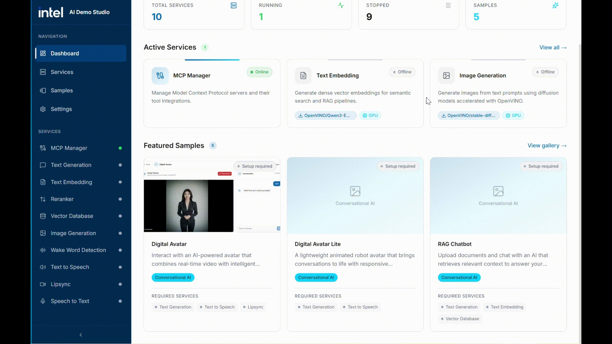

# Edge AI Demo Studio

Edge AI Demo Studio is a modern toolkit for deploying, managing, and serving AI models on edge platforms. It features a web-based UI for device, workload, and user management, and is optimized for Intel hardware and edge environments.



## Features

- **Easy Model Deployment:** Download, convert, and serve Hugging Face models with minimal setup.
- **Web-Based Management:** Manage devices, workloads, and users through a modern web interface.
- **Edge Optimized:** Built for Intel hardware and edge environments.
- **AI Services:** AI Services that users can use for their applications
  - Text Generation (LLM)
  - Text to Speech (TTS)
  - Speech to Text (STT)
  - Embedding 
  - Lipsync
  - Image Generation
  - MCP Manager
  - Wake Word Detection
- **Samples:** Samples use cases that implements the ai services
  - Digital Avatar
  - RAG Chat

## Architecture Diagram


## Software Requirements

- **Operating System:**
  - Ubuntu 24.04 LTS (other Linux distributions may work, but are not officially supported)
  - Windows 11 24H1 (other versions may work, but this is the validated version)
- **Other:** See [install_dependencies.sh](install_dependencies.sh) for required system packages.

---


## Quick Start

### 1. Install System Dependencies (Linux only)

```bash
sudo ./install_dependencies.sh
```

### 2. Set Up Python & Node.js Dependencies

For Linux:
```bash
./setup.sh
```
For Windows (PowerShell/Command Prompt):
```bash
./setup_win.bat
```

This will:
- Set up a Python virtual environment
- Install Python and Node.js dependencies
- Start the frontend

---

### 3. Start the App
For Linux:
```bash
./start.sh
```
For Windows (PowerShell/Command Prompt):
```bash
./start_win.bat
```

Once started, access the web UI at [http://localhost:8080](http://localhost:8080).

---


## Project Structure

```
applications.ai.tools.edge-ai-demo-studio/
├── electron/         # Electron app
├── frontend/         # Next.js web frontend
├── workers/          # Python/AI backend services
├── models/           # Downloaded/converted models
├── scripts/          # Utility scripts
├── install_dependencies.sh  # System dependency installer
├── setup.sh / setup.ps1     # Project setup scripts
└── README.md
```

---


## Development

See [docs/DEVELOPMENT.md](docs/DEVELOPMENT.md) for development guidelines.

---


## Deployment

The app is deployed using Electron to package the application.
See [docs/DEPLOYMENT.md](docs/DEPLOYMENT.md) for deployment guidelines.

---


## FAQ

**Q: Why is Electron Skipped by default**

This is because Electron is being used to create a packaged release only. If you need a packaged release, please refer to [docs/DEPLOYMENT.md](docs/DEPLOYMENT.md)
