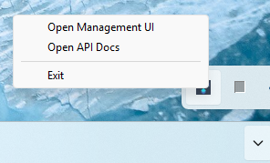

# Multi-Backend Inference Server

A unified, local inference server for managing, running, and monitoring multiple LLM backends (Llama.cpp, OpenAI-compatible APIs, and more) with a modern web dashboard and tray integration.

## Features

- **Model Management**: Download, verify, start, stop, and delete LLM models from Hugging Face or manually.
- **Multi-Task Support**: Supports text generation, embeddings, reranking, and multimodal models.
- **Device Selection**: Run models on CPU, GPU, or NPU (if supported).
- **Web Dashboard**: Modern UI for status, logs, and model management.
- **Tray App**: System tray integration for quick access and server control.
- **OpenAI Proxy**: Exposes OpenAI-compatible endpoints for easy integration.
- **Cross-Platform**: Windows and Linux support.

## Directory Structure

```
.
├── app.py                  # Main FastAPI application entrypoint
├── modules/                # Core Python modules
│   ├── llamacpp/           # Llama.cpp management and GGUF downloader
│   ├── gpu_metrics.py      # XPU/GPU metrics collection
│   ├── tray_app.py         # System tray integration
│   └── utils.py            # Utility functions
├── routers/                # FastAPI routers (API endpoints)
├── engine/                 # Native binaries, licenses, and XPU headers
├── static/                 # Web dashboard static files
├── tests/                  # Example tests
├── config.yaml             # Model/task configuration
├── verified.yaml           # List of verified models
├── pyproject.toml          # Python dependencies
└── README.md               # This file
```

## Quick Start

1. **Install dependencies**  
   Python 3.12+ is required. This project uses `uv` for fast dependency management.

   ```sh
   # Install uv (if you don't have it)
   pip install uv

   # Create a virtual environment and install dependencies
   uv sync
   ```

2. **Run the server**

   ```sh
   uv run app.py
   ```

3. **Support LlamaCPP backend and OVMS backend**

   ```sh
   uv run app.py --backend ovms # for OVMS backend
   uv run app.py --backend llamacpp # for LlamaCPP backend
   ```

4. **Access the dashboard**  
   Open [http://127.0.0.1:8000](http://127.0.0.1:8000) in your browser.

5. **Tray App**  
   The tray icon should appear automatically when running on supported platforms.

## Model Management

- **Download**: Use the dashboard or API to download models by Hugging Face repo ID.
- **Start/Stop**: Start or stop models for different tasks (text generation, embeddings, rerank, multimodal).
- **Device Selection**: Choose CPU/GPU/NPU for inference (if available).
- **Logs**: View download and runtime logs in the dashboard.

## API Endpoints

- **/v1/model**: List available/downloaded models
- **/v1/start**: Start or swap a model
- **/v1/stop**: Stop a running model
- **/v1/download**: Download a model
- **/v1/delete**: Delete a model
- **/v1/status**: Get server and model status
- **/v1/chat/completions**: OpenAI-compatible endpoints
- **/v1/embeddings**: OpenAI-compatible endpoints
- **/v1/rerank**: OpenAI-compatible endpoints

## Configuration

- **config.yaml**: Controls active models and default parameters.
- **verified.yaml**: List of models considered "verified" for auto-discovery.

## Building a Standalone App

This project supports PyInstaller for packaging as a standalone executable. See [app.spec](app.spec) for build configuration.

## Running the App

App will launched in tray mode



Click the **Open Management UI** will launch the dashboard in browser


Click the **Open API Docs** will launch the Swagger API docs in browser


## License

- Third-party binaries and libraries: See `engine/llama.cpp/` for individual licenses.

---
