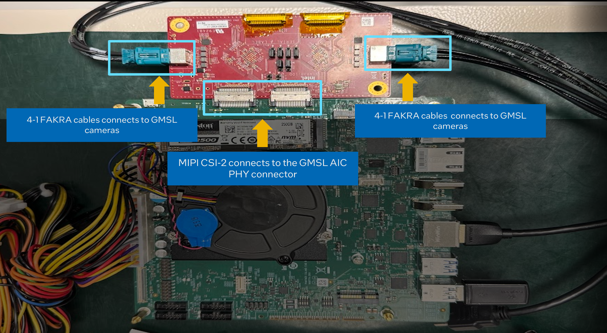
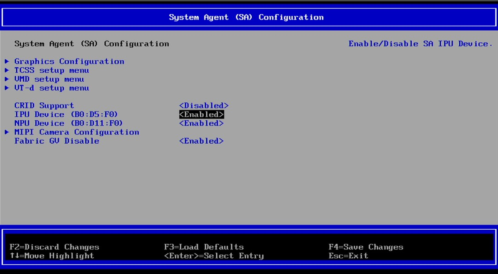
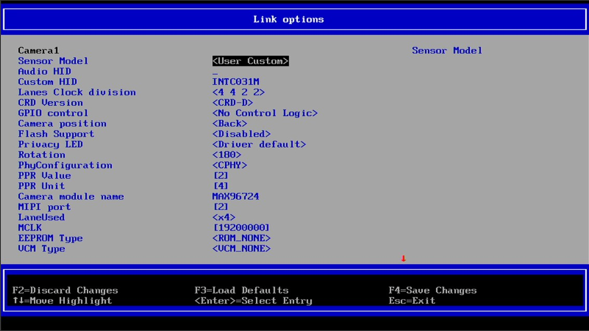
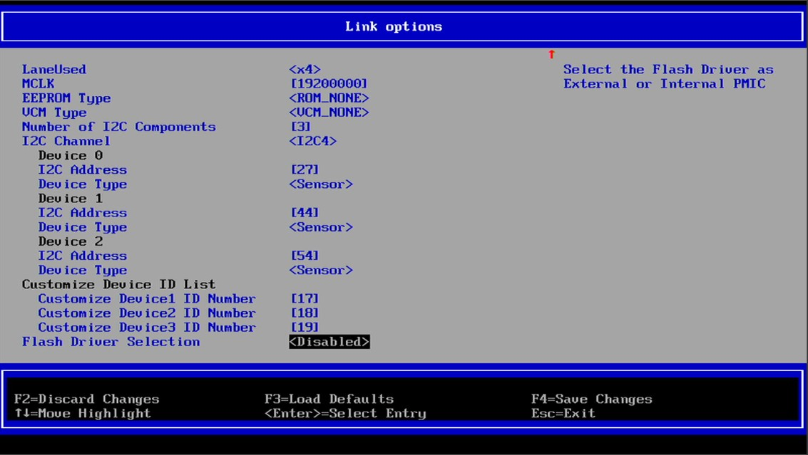
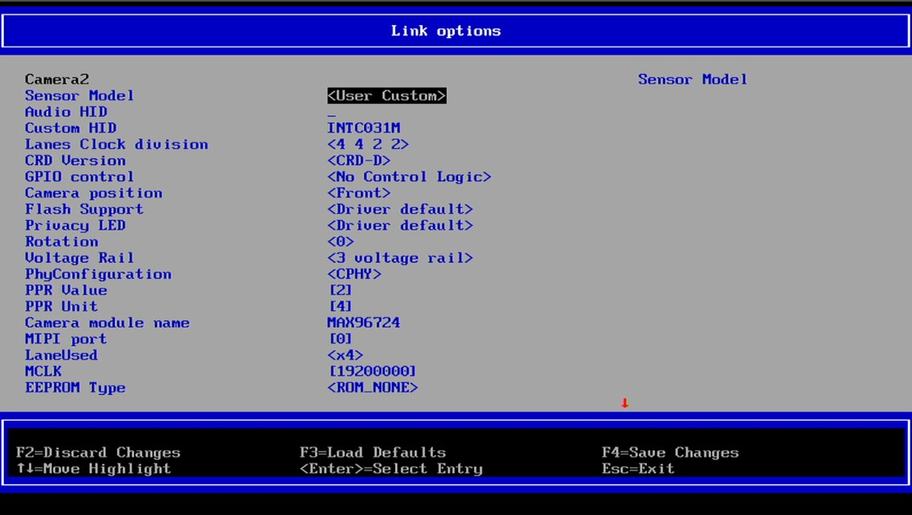
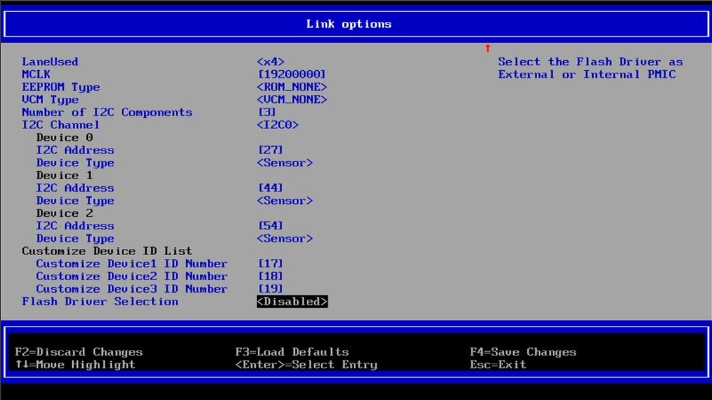

# IPU7 GMSL Camera Quick Start Guide (Draft)

## 1. Introduction

This document is a draft Quick Start Guide (QSG) for bringing up an IPU7-based GMSL camera pipeline on Ubuntu* 24.04 using the scripts in this repository.

Scope:
- Hardware: an IPU7-capable Intel® platform, a GMSL add-in card (AIC), and GMSL cameras.


> Note: BIOS menus and exact settings vary by platform vendor.

## 2. Table of Contents

- [1. Introduction](#1-introduction)
- [2. Table of Contents](#2-table-of-contents)
- [3. System requirements](#3-system-requirements)
- [4. Validated System](#4-validated-system)
- [5. Hardware Setup and Connections](#5-hardware-setup-and-connections)
- [6. BIOS configuration](#6-bios-configuration)
- [7. Software QSG](#7-software-qsg)
- [8. Support and Documentation](#8-support-and-documentation)
- [Trademarks](#trademarks)

## 3. System requirements

### Operating system

- Ubuntu 24.04 (Noble Numbat)

### Kernel

- 6.17+ for Intel® Core™ Ultra Processors (Series 3)

### Hardware

- CPU/platform: Intel® Core™ Ultra Processors (Series 3)
- Memory: 8 GB RAM minimum (16 GB recommended for multi-camera, 64GB recommended for multi-camera with AI application)
- Storage: Minimum of 256 GB free disk space
- GMSL cameras and GMSL Max96724 AIC card
- Network access to download packages and keys

## 4. Validated System

The exact validated matrix can change across kernel, firmware, and camera/AIC revisions. Use this section as reference. 

| Product Collection | Codename | Camera | Support | Validated Hardware |
|---------|--------|---------|--------|---------|
| Intel® Core™ Ultra Processors (Series 3) | Products formerly Panther Lake | 8 x D3 - ISX031 | ✅ Supported | Innodisk Intel® Core™ Ultra Series 3 Reference Kit |

## 5. Hardware Setup and Connections

1. Power off the system and disconnect AC power.
2. Install the GMSL AIC into an appropriate MIPI CSI-2 slot.
3. Connect GMSL cameras to the AIC as recommended in the image below.



4. Reconnect power and boot the system.

## 6. BIOS configuration

> Note: BIOS menus and exact settings vary by platform vendor and camera sensor.

BIOS options are platform-specific. Configure the platform BIOS to enable the IPU7 and the Intel GMSL SERDES ACPI devices as required in the System Agent (SA) Configuration.

1. Enable IPU and NPU device. 


2. Navigate to MIPI Camera Configuration


> Note: Only enable Camera1 for 4 cameras configuration.

3. Enable Camera1 and Camera2 for 8 cameras configuration. 


4. In Camera1 menu, apply all the necessary config for MIPI Port A.



5. In Camera2 menu, apply all the necessary config for MIPI Port C.



6. Press F4 to save the changes and navigate to the main BIOS menu page to continue.
System will go into reboot state. 


## 7. Software QSG

1. Ensure you follow this guide [Intel® Core™ Ultra Processors (Series 3) RDC](https://cdrdv2.intel.com/v1/dl/getContent/858119/view) to boot up the system. 

After reboot, perform basic checks:

```bash
# Kernel
uname -r

# IPU6 device detection
lspci -nn | grep -E "8086:a75d|8086:7d19" || true

# Kernel modules (module names can vary by release)
lsmod | grep -i ipu || true

```

2. Ensure the camera devices are enumerated successfully.

3. Use the commands below to stream.

Notes:
- For multi-camera, set `num-vc` to the total number of cameras (4 or 8) for each `icamerasrc` instance.
- Use `device-name=isx031-<N>` (for example, `isx031-1`, `isx031-2`, and so on).

### Single camera (1)

```bash
gst-launch-1.0 icamerasrc num-buffers=600 scene-mode=auto device-name=isx031-1 io-mode=dma_mode printfps=true ! 'video/x-raw(memory:DMABuf),drm-format=UYVY,width=1920,height=1536' ! glimagesink sync=false
```

### 4 cameras

```bash
gst-launch-1.0 \
	icamerasrc num-vc=4 num-buffers=600 scene-mode=auto device-name=isx031-1 io-mode=dma_mode printfps=true ! 'video/x-raw(memory:DMABuf),drm-format=UYVY,width=1920,height=1536' ! glimagesink sync=false \
	icamerasrc num-vc=4 num-buffers=600 scene-mode=auto device-name=isx031-2 io-mode=dma_mode printfps=true ! 'video/x-raw(memory:DMABuf),drm-format=UYVY,width=1920,height=1536' ! glimagesink sync=false \
	icamerasrc num-vc=4 num-buffers=600 scene-mode=auto device-name=isx031-3 io-mode=dma_mode printfps=true ! 'video/x-raw(memory:DMABuf),drm-format=UYVY,width=1920,height=1536' ! glimagesink sync=false \
	icamerasrc num-vc=4 num-buffers=600 scene-mode=auto device-name=isx031-4 io-mode=dma_mode printfps=true ! 'video/x-raw(memory:DMABuf),drm-format=UYVY,width=1920,height=1536' ! glimagesink sync=false
```

### 8 cameras

```bash
gst-launch-1.0 \
	icamerasrc num-vc=8 num-buffers=600 scene-mode=auto device-name=isx031-1 io-mode=dma_mode printfps=true ! 'video/x-raw(memory:DMABuf),drm-format=UYVY,width=1920,height=1536' ! glimagesink sync=false \
	icamerasrc num-vc=8 num-buffers=600 scene-mode=auto device-name=isx031-2 io-mode=dma_mode printfps=true ! 'video/x-raw(memory:DMABuf),drm-format=UYVY,width=1920,height=1536' ! glimagesink sync=false \
	icamerasrc num-vc=8 num-buffers=600 scene-mode=auto device-name=isx031-3 io-mode=dma_mode printfps=true ! 'video/x-raw(memory:DMABuf),drm-format=UYVY,width=1920,height=1536' ! glimagesink sync=false \
	icamerasrc num-vc=8 num-buffers=600 scene-mode=auto device-name=isx031-4 io-mode=dma_mode printfps=true ! 'video/x-raw(memory:DMABuf),drm-format=UYVY,width=1920,height=1536' ! glimagesink sync=false \
	icamerasrc num-vc=8 num-buffers=600 scene-mode=auto device-name=isx031-5 io-mode=dma_mode printfps=true ! 'video/x-raw(memory:DMABuf),drm-format=UYVY,width=1920,height=1536' ! glimagesink sync=false \
	icamerasrc num-vc=8 num-buffers=600 scene-mode=auto device-name=isx031-6 io-mode=dma_mode printfps=true ! 'video/x-raw(memory:DMABuf),drm-format=UYVY,width=1920,height=1536' ! glimagesink sync=false \
	icamerasrc num-vc=8 num-buffers=600 scene-mode=auto device-name=isx031-7 io-mode=dma_mode printfps=true ! 'video/x-raw(memory:DMABuf),drm-format=UYVY,width=1920,height=1536' ! glimagesink sync=false \
	icamerasrc num-vc=8 num-buffers=600 scene-mode=auto device-name=isx031-8 io-mode=dma_mode printfps=true ! 'video/x-raw(memory:DMABuf),drm-format=UYVY,width=1920,height=1536' ! glimagesink sync=false
```

## 8. Support and Documentation

Repository documentation:
- [usecases/camera/TROUBLESHOOTING.md](../TROUBLESHOOTING.md)
- [usecases/camera/mipi/README.md](../mipi/README.md)
- [usecases/camera/gmsl/ECI-README.md](ECI-README.md)

External references:
- [Intel ECI GMSL tutorial](https://eci.intel.com/docs/3.3/development/tutorials/enable-gmsl.html)
- [Intel® RealSense™ documentation](https://dev.intelrealsense.com/)
- [ROS 2* documentation (Jazzy)](https://docs.ros.org/en/jazzy/)

If you are blocked:
- Capture `uname -r`, `lspci -nn`, and relevant `dmesg` excerpts.
- Include BIOS version and the exact AIC + camera model/firmware revisions.

## Trademarks

Ubuntu* is a trademark of Canonical Ltd.