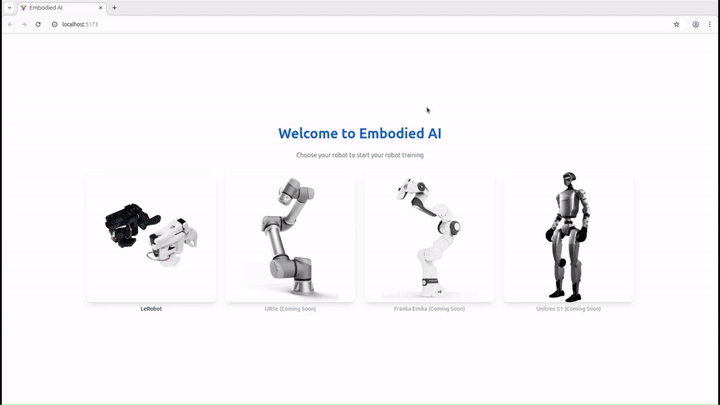
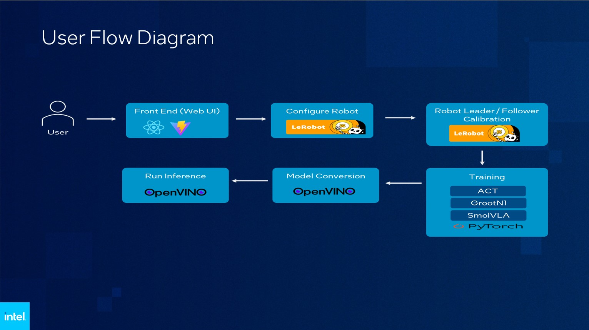
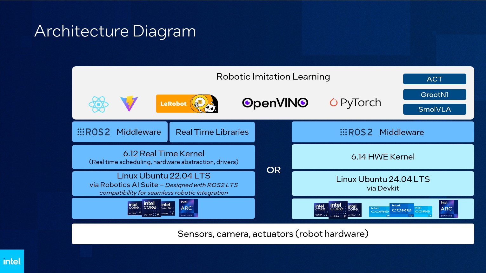

# Deprecated: This application is no longer maintained and will be removed soon. It will be replaced by Physical AI Studio; for more information, see the [Physical AI Studio repository](https://github.com/open-edge-platform/physical-ai-studio).

# Robotic Imitation Learning

A lightweight UI and server for robotic imitation learning—covering data capture, conversion, and inference—for a robotic arm demo integrated with Intel® Robotics AI Suite components. The project provides a Python server for data handling and a web UI for interaction.

Robotic imitation learning demo showing a web dashboard controlling a robotic arm during a training session in a lab with UI panels displaying camera view controls, movement controls, and status indicators in a focused technical setting. 

## Features

- Compatible with Intel® Robotics AI Suite components or Edge Developer Kit Reference Scripts
- Data capture: Record sensor/telemetry and control events
- Conversion tools: Optional data format conversion utilities
- Inference: Run model inference scripts from the server
- Web UI: Vite-based frontend for control and visualization
- Modular layout: Separate `server` and `webui` workflows

## Architecture Diagram

## Directory Structure

- `server/`: Python server, configs, and scripts
- `webui/`: Frontend app (Vite + Node.js*)

## Hardware Requirements

- CPU: Intel® Core™ Ultra processors (Series 2) and above
- GPU: Intel® Arc™ B-Series Graphics (Optional)
- RAM: 32GB RAM
- SSD: 500GB and above

## Software Requirements

- **Operating System:** Ubuntu 24.04 LTS

## Setup (Server)

Follow the [doc](server/README.md) to setup

## Setup (Web UI)

Follow the [doc](webui/README.md) to setup

## Trademarks and Notes

- Intel®, Intel® Atom®, Intel® Core™, Intel® Xeon® are trademarks of Intel Corporation.
- Third-party names such as Ubuntu*, Node.js*, NVM*, Vite*, GitHub* are used for identification purposes only.
   - Ubuntu* is a trademark of Canonical Limited.
   - Node.js* and NPM* are trademarks of OpenJS Foundation.

## License

This project is licensed under the Apache License, Version 2.0.
